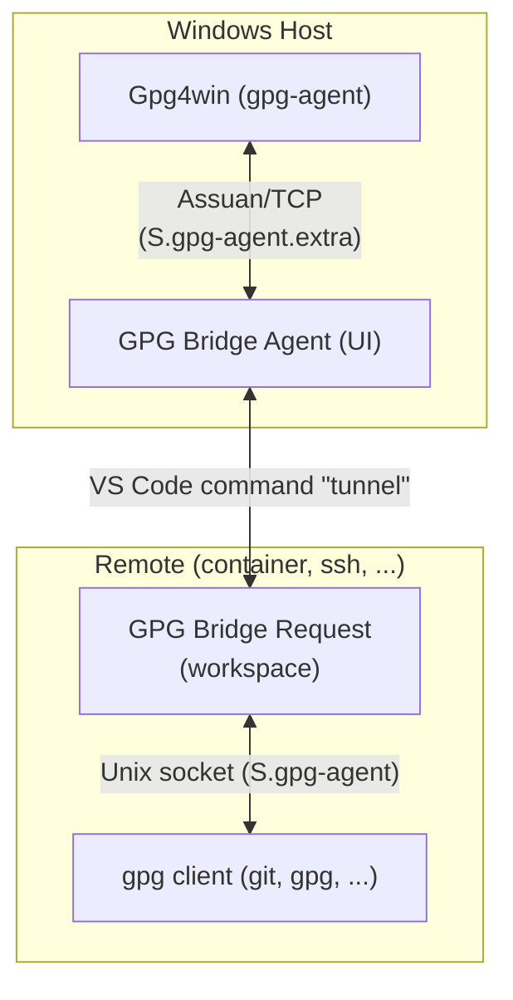

# GPG Bridge


<!-- Badges  update URLs after Phase 5 marketplace publish -->
<!--  -->
<!--  -->
<!--  -->

Bridge GPG operations from Linux remotes (WSL, Dev Containers, SSH) to the GPG agent
on your Windows host running [Gpg4win](https://www.gpg4win.org/). Sign commits,
verify signatures, and encrypt/decrypt files from any remote environment — no extra
configuration needed on the remote side.

This is an extension **pack** that installs two cooperating components:

- **GPG Bridge Agent** (`hidale.gpg-bridge-agent`) — runs on your Windows host, connects to Gpg4win
- **GPG Bridge Request** (`hidale.gpg-bridge-request`) — runs in each remote environment, presents a standard GPG agent socket

## Requirements

| Requirement | Detail |
|-------------|--------|
| **Windows host** | [Gpg4win](https://www.gpg4win.org/) v4.4.1+ installed and working |
| **VS Code** | v1.91.0+ with remote support (WSL, Dev Containers, or Remote-SSH extension) |
| **Remote** | WSL, Dev Container, or SSH — any Linux environment VS Code can connect to |

## Installation

Search for **GPG Bridge** in the VS Code Extensions sidebar, or install from
the [marketplace page](https://marketplace.visualstudio.com/items?itemName=hidale.gpg-bridge).
Both component extensions install automatically.

### Manual installation from VSIX

Download the two `.vsix` files from the [GitHub Releases page](https://github.com/diablodale/gpg-bridge/releases)
and install them via the VS Code CLI:

```sh
code --install-extension gpg-bridge-agent-<version>.vsix
code --install-extension gpg-bridge-request-<version>.vsix
```

Or via the UI: open the Extensions sidebar, click the **`···`** menu, choose
**Install from VSIX…**, and repeat for each file.

> ℹ️ Install both files. The agent and request extensions work together and
> must both be present.

Both proxies start automatically when VS Code opens — no manual start needed.

## How It Works



The Agent extension reads Gpg4win's "extra" socket file location with `gpgconf`,
authenticates with the nonce, and bridges the session over VS Code's built-in
command tunnel. The Request extension creates a Unix socket on the remote
at the standard GPG agent path (`S.gpg-agent` via `gpgconf`) so existing
apps and tools need no reconfiguration.

All data passes through the bridge as a transparent byte-stream proxy using `latin1` encoding
to preserve raw binary content (signatures, encrypted blocks, nonces) unchanged.

## Configuration

| Setting | Default | Description |
|---------|---------|-------------|
| `gpgBridgeAgent.gpgBinDir` | *(auto-detect)* | Path to the GnuPG `bin` directory containing `gpgconf` (e.g. Gpg4win's `C:\Program Files\GnuPG\bin`). Leave empty to auto-detect. |
| `gpgBridgeAgent.debugLogging` | `false` | Enable verbose logging in the **GPG Bridge Agent** output channel |
| `gpgBridgeRequest.debugLogging` | `false` | Enable verbose logging in the **GPG Bridge Request** output channel |

```json
{
  "gpgBridgeAgent.gpgBinDir": "C:\\Program Files\\GnuPG\\bin",
  "gpgBridgeAgent.debugLogging": false,
  "gpgBridgeRequest.debugLogging": false
}
```

## Commands

Both proxies start automatically. These commands are available via the Command Palette
(`Ctrl+Shift+P`) if you need to manually control them:

| Command | Runs on | Description |
|---------|---------|-------------|
| `GPG Bridge Agent: Start` | Windows host | Start the agent proxy |
| `GPG Bridge Agent: Stop` | Windows host | Stop the agent proxy |
| `GPG Bridge Agent: Show Status` | Windows host | Display current proxy status and session count |
| `GPG Bridge Request: Start` | Remote | Start the request proxy |
| `GPG Bridge Request: Stop` | Remote | Stop the request proxy |

## Typical Workflow

1. Open VS Code on Windows — **GPG Bridge Agent** starts automatically
2. Open a WSL / Dev Container / SSH remote — **GPG Bridge Request** starts automatically
3. GPG operations in the remote now use your Windows keys

To verify it is working, run in a remote terminal:

```bash
gpg --list-keys      # should list your Windows keyring
git commit -S -m "test"   # signed commit should succeed
```

## Architecture

This project uses a three-part monorepo:

```text
gpg-bridge-agent/    agent proxy (Windows UI context)
gpg-bridge-request/  request proxy (remote workspace context)
pack/                extension pack manifest (no code)
shared/              shared protocol utilities (@gpg-bridge/shared)
```

A three-extension architecture is necessary because a single multi-context extension
cannot reliably auto-activate in all remote scenarios. The agent must run in the Windows
UI context; the request must run in the remote workspace context. The pack bundles both
so users install one item.

For detailed protocol and state machine documentation see:
- [gpg-bridge-agent/README.md](gpg-bridge-agent/README.md)
- [gpg-bridge-request/README.md](gpg-bridge-request/README.md)
- [docs/gpg-agent-protocol.md](docs/gpg-agent-protocol.md)

## Contributing

See [CONTRIBUTING.md](CONTRIBUTING.md) for dev setup, build, test, and commit guidelines.
