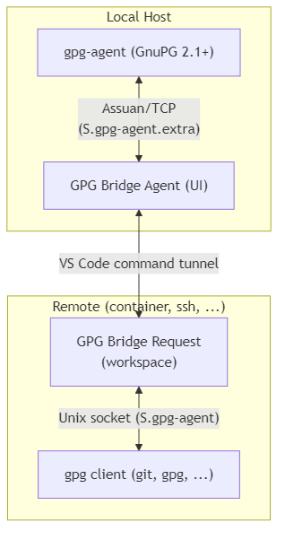

# GPG Bridge


<!-- Badges  update URLs after Phase 5 marketplace publish -->
<!--  -->
<!--  -->
<!--  -->

Bridge GPG operations from Linux remotes (WSL, Dev Containers, SSH) to the GPG agent
on your local host running [GnuPG](https://gnupg.org/) 2.1+. Sign commits,
verify signatures, and encrypt/decrypt files from any remote environment — no extra
configuration needed on the remote side.

This is an extension **pack** that installs two cooperating components:

- **GPG Bridge Agent** (`hidale.gpg-bridge-agent`) — runs on your local host, connects to the local GPG agent
- **GPG Bridge Request** (`hidale.gpg-bridge-request`) — runs in each remote environment, presents a standard GPG agent socket

## Requirements

| Requirement    | Detail                                                                                                                                       |
| -------------- | -------------------------------------------------------------------------------------------------------------------------------------------- |
| **Local host** | [GnuPG](https://gnupg.org/) 2.1+ installed and working (e.g. [Gpg4win](https://www.gpg4win.org/) on Windows, `gnupg` package on Linux/macOS) |
| **VS Code**    | v1.108.1+ with remote support (WSL, Dev Containers, or Remote-SSH extension)                                                                 |
| **Remote**     | WSL, Dev Container, or SSH — any Linux environment VS Code can connect to                                                                    |

## Installation

Search for **GPG Bridge** in the VS Code Extensions sidebar, or install from
the [marketplace page](https://marketplace.visualstudio.com/items?itemName=hidale.gpg-bridge).
Both component extensions install automatically.

### Manual installation from VSIX

Download the two `.vsix` files from the [GitHub Releases page](https://github.com/diablodale/gpg-bridge/releases)
and install them via the VS Code CLI:

```sh
code --install-extension gpg-bridge-agent-<version>.vsix
code --install-extension gpg-bridge-request-<version>.vsix
```

Or via the UI: open the Extensions sidebar, click the **`···`** menu, choose
**Install from VSIX…**, and repeat for each file.

> ℹ️ Install both files. The agent and request extensions work together and
> must both be present.

Both extensions start automatically when VS Code opens — no manual start needed.

## How It Works



1. _Request_ extension queries gpg's standard socket location with `gpgconf`
2. _Request_ creates the standard socket to listen for remote client gpg commands
3. _Agent_ extension queries gpg's "extra" restricted socket location with `gpgconf`
4. _Agent_ authenticates with _gpg-agent_ and validates its connectivity
5. Remote _client_ starts a session by opening a connection to the standard socket
6. _Client_ sends gpg commands to the standard socket
7. _Request_ bridges commands over VS Code's built-in command tunnel to the _Agent_
8. _Agent_ authenticates and forwards the commands to the host _gpg-agent_
9. _gpg-agent_ replies, _Agent_ replies, and _Request_ replies back to the remote _client_
10. _Client_ completes, or an error along the path closes the session
    <br clear="right" />

## Configuration

| Setting                               | Default         | Description                                                                                                                                                                                  |
| ------------------------------------- | --------------- | -------------------------------------------------------------------------------------------------------------------------------------------------------------------------------------------- |
| `gpgBridgeAgent.gpgBinDir`            | _(auto-detect)_ | Path to the GnuPG `bin` directory containing `gpgconf` (e.g. `C:\Program Files\GnuPG\bin` on Windows, `/usr/bin` on Linux). Leave empty to auto-detect.                                      |
| `gpgBridgeAgent.debugLogging`         | `false`         | Enable verbose logging in the **GPG Bridge Agent** output channel                                                                                                                            |
| `gpgBridgeRequest.gpgBinDir`          | _(auto-detect)_ | Path to the GnuPG `bin` directory on the remote (e.g. `/usr/local/bin`). Leave empty to auto-detect via PATH.                                                                                |
| `gpgBridgeRequest.autoSyncPublicKeys` | _(empty)_       | Automatically sync public keys from the local keyring on activation. `"all"` exports all keys, `"pairs"` exports keys with matching private keys, or an array of specific fingerprints/UIDs. |
| `gpgBridgeRequest.debugLogging`       | `false`         | Enable verbose logging in the **GPG Bridge Request** output channel                                                                                                                          |

```jsonc
{
  // examples
  "gpgBridgeAgent.gpgBinDir": "C:\\Program Files\\GnuPG\\bin",
  "gpgBridgeAgent.debugLogging": true,
  "gpgBridgeRequest.gpgBinDir": "/usr/bin",
  "gpgBridgeRequest.debugLogging": true,
  "gpgBridgeRequest.autoSyncPublicKeys": "pairs",
  "gpgBridgeRequest.autoSyncPublicKeys": ["jane@example.com", "51761A86"],
}
```

## Commands

Both extensions start automatically. These commands are available via the Command Palette
(`Ctrl+Shift+P`) if you need to manually control them:

| Command                                | Runs on    | Description                                                    |
| -------------------------------------- | ---------- | -------------------------------------------------------------- |
| `GPG Bridge Agent: Start`              | Local host | Start the agent bridge                                         |
| `GPG Bridge Agent: Stop`               | Local host | Stop the agent bridge                                          |
| `GPG Bridge Agent: Show Status`        | Local host | Display current proxy status and session count                 |
| `GPG Bridge Request: Start`            | Remote     | Start the request bridge                                       |
| `GPG Bridge Request: Stop`             | Remote     | Stop the request bridge                                        |
| `GPG Bridge Request: Sync public keys` | Remote     | Manually sync public keys from the local keyring to the remote |

## Typical Workflow

1. Open VS Code on your local host — **GPG Bridge Agent** starts automatically
2. Open a WSL / Dev Container / SSH remote — **GPG Bridge Request** starts automatically
3. GPG operations in the remote now use your local host's keys. Existing apps and tools
   need no reconfiguration.

To verify it is working, run in a remote terminal:

```bash
gpg --list-keys      # should list your local host's keyring
git commit -S -m "test"   # signed commit should succeed
```

## Architecture

This project uses a three-part monorepo:

```text
gpg-bridge-agent/    agent bridge (local host UI context)
gpg-bridge-request/  request bridge (remote workspace context)
pack/                extension pack manifest (no code)
shared/              shared protocol utilities (@gpg-bridge/shared)
```

A three-extension architecture is necessary because a single multi-context extension
cannot reliably auto-activate in all remote scenarios. The agent must run in the local host
UI context; the request must run in the remote workspace context. The pack bundles both
so users install one item.

For detailed protocol and state machine documentation see:

- [gpg-bridge-agent/README.md](gpg-bridge-agent/README.md)
- [gpg-bridge-request/README.md](gpg-bridge-request/README.md)
- [docs/gpg-agent-protocol.md](docs/gpg-agent-protocol.md)

## Contributing

See [CONTRIBUTING.md](CONTRIBUTING.md) for dev setup, build, test, and commit guidelines.
