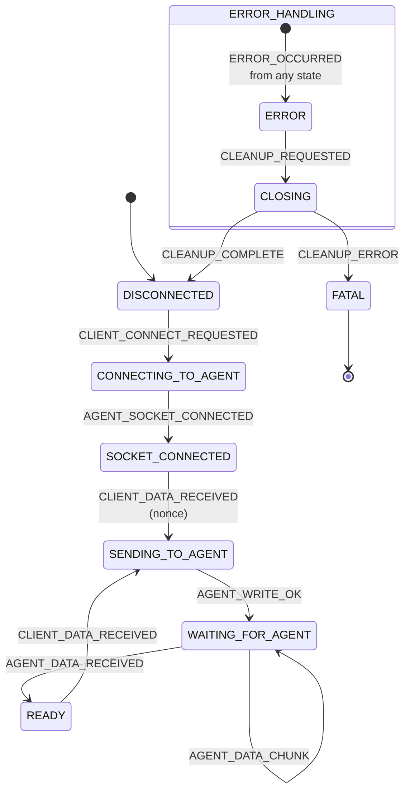

# GPG Bridge Agent — Internal Architecture

Developer reference for `gpg-bridge-agent`. Covers the state machine, public VS Code
command API, session management, testing approach, and error handling.

See also:

- [AGENTS.md](../AGENTS.md) — project-wide coding conventions and state machine pattern
- [docs/agent-state-machine-refactor.md](agent-state-machine-refactor.md) — original refactor plan
- [docs/gpg-agent-protocol.md](gpg-agent-protocol.md) — Assuan/GPG protocol background
- [CONTRIBUTING.md](../CONTRIBUTING.md) — build, test, and commit instructions

---

## Architecture

The agent proxy uses an **EventEmitter-based state machine** with 9 states and 10 events
to manage GPG agent connections. Each session is tracked independently in a `Map`,
allowing concurrent sessions from multiple remotes.

### States (9 Total)

1. **DISCONNECTED** — No active connection, session can be created
2. **CONNECTING_TO_AGENT** — TCP socket connection in progress
3. **SOCKET_CONNECTED** — Socket connected, ready to send nonce
4. **READY** — Connected and authenticated, can accept commands (including BYE)
5. **SENDING_TO_AGENT** — Command write in progress to agent (nonce or command)
6. **WAITING_FOR_AGENT** — Accumulating response chunks from agent (greeting or command response)
7. **ERROR** — Error occurred, cleanup needed
8. **CLOSING** — Cleanup in progress (socket teardown, session removal)
9. **FATAL** — Unrecoverable cleanup failure; session permanently dead

Terminal states:

- **DISCONNECTED** (session removed from Map; new session can be created)
- **FATAL** (unrecoverable cleanup failure; session removed from Map permanently)

### Events (10 Total)

**Client Events** (from gpg-bridge-request):

- `CLIENT_CONNECT_REQUESTED` — `connectAgent()` called
- `CLIENT_DATA_RECEIVED` — Data received (nonce Buffer or command string)

**Agent Events** (from gpg-agent or socket operations):

- `AGENT_SOCKET_CONNECTED` — TCP socket connected to agent
- `AGENT_WRITE_OK` — Write succeeded (nonce or command)
- `AGENT_DATA_CHUNK` — Response data chunk received from agent
- `AGENT_DATA_RECEIVED` — Complete response received (greeting or command response)

**Error & Cleanup Events**:

- `ERROR_OCCURRED` — Any error (connection, write, timeout, socket, validation, protocol violation)
- `CLEANUP_REQUESTED` — Cleanup beginning with `hadError: boolean` payload
- `CLEANUP_COMPLETE` — Cleanup successful
- `CLEANUP_ERROR` — Cleanup failed

### State Transition Flow



---

## Socket Close Handling

**CRITICAL:** Node.js socket `'close'` event can fire in **ANY** state where a socket
exists, not just expected states. The handler must be defensive.

### hadError Routing

- **hadError=false** (graceful close): direct transition → `emit('CLEANUP_REQUESTED', false)` → CLOSING
  - Examples: BYE command response, agent-initiated close, clean shutdown
- **hadError=true** (transmission error): → `emit('ERROR_OCCURRED', ...)` → ERROR → CLOSING
  - Examples: Network failure, connection refused, TCP reset

### Socket Close in All States

| State               | How it can occur                                                    |
| ------------------- | ------------------------------------------------------------------- |
| CONNECTING_TO_AGENT | Connection refused, network error during handshake                  |
| SOCKET_CONNECTED    | Error after connect, before nonce sent                              |
| READY               | Agent crash, network failure, agent-initiated close                 |
| SENDING_TO_AGENT    | Write failure, agent crashes during write                           |
| WAITING_FOR_AGENT   | Agent crashes, network failure, BYE race condition                  |
| ERROR               | Socket close during error handling (ignored, already in error path) |
| CLOSING             | Expected close during cleanup (ignored)                             |
| DISCONNECTED        | No socket (ignored, shouldn't happen)                               |

---

## BYE Command Flow

BYE is **not a special case** — it flows through the normal command path:

1. `disconnectAgent(sessionId)` calls `sendCommands(sessionId, 'BYE\n')`
2. State transitions: READY → SENDING_TO_AGENT → WAITING_FOR_AGENT → READY
3. GPG agent responds with `OK` and closes the socket per protocol spec
4. Socket `'close'` fires with `hadError=false` (graceful)
5. Handler emits `CLEANUP_REQUESTED` → CLOSING → cleanup → DISCONNECTED

Benefits: reuses all existing command machinery; no separate DISCONNECTING state;
handles BYE race conditions naturally.

---

## Timeout Strategy

The agent proxy uses **selective timeouts**:

- ✅ **Connection timeout (5s)** — network operation, should complete quickly
- ✅ **Greeting timeout (5s)** — nonce authentication, non-interactive
- ❌ **No response timeout** — commands can be interactive (pinentry prompts, INQUIRE)

**Rationale:** GPG operations often require human interaction through pinentry. As a
passthrough proxy we cannot distinguish network timeouts from human processing delays.
Network failures are detected via socket `'close'` events instead.

---

## Concurrent Command Prevention

Sending commands while not in READY state is a protocol violation. `sendCommands()`
validates session is in READY state **before** emitting `CLIENT_DATA_RECEIVED`. If not
READY, emits `ERROR_OCCURRED` and rejects the promise.

---

## Public API

Three VS Code commands are exposed for `gpg-bridge-request`:

### `_gpg-bridge-agent.connectAgent`

Creates a new session and connects to the GPG agent.

**Arguments:** None  
**Returns:** `Promise<string>` — Session ID (UUID)  
**Throws:** Connection errors, timeout errors, validation errors

**Flow:**

1. Creates new session with UUID
2. Parses GPG socket file (host, port, nonce)
3. Connects to TCP socket
4. Sends nonce for authentication
5. Validates greeting response (must start with "OK")
6. Returns session ID

**Timeouts:** Connection: 5s, Greeting: 5s

### `_gpg-bridge-agent.sendCommands`

Sends a command block to the GPG agent and returns the complete response.

**Arguments:**

- `sessionId: string` — Session ID from `connectAgent()`
- `commandBlock: string` — GPG command(s) to send (e.g., `"BYE\n"`)

**Returns:** `Promise<string>` — Response from GPG agent  
**Throws:** Session not found, not in READY state, write errors, protocol errors  
**Timeouts:** None (supports interactive operations)

### `_gpg-bridge-agent.disconnectAgent`

Disconnects from the GPG agent and cleans up the session.

**Arguments:**

- `sessionId: string` — Session ID from `connectAgent()`

**Returns:** `Promise<void>`

**Note:** Implemented as `sendCommands(sessionId, 'BYE\n')` — not a special case.

---

## Session Management

Sessions are stored in `Map<string, AgentProxySession>` keyed by UUID.

**Lifecycle:**

1. Created in DISCONNECTED state by `connectAgent()`
2. Transitions through states via event handlers
3. Cleaned up and removed from Map in `handleCleanupComplete()`

**Cleanup guarantees:**

- Socket listeners removed via `removeAllListeners()`
- Socket destroyed via `socket.destroy()`
- Pending promises rejected on error
- Session deleted from Map
- First-error-wins pattern (cleanup continues even if one step fails)

---

## Testing

Dependency injection interface:

```typescript
interface AgentProxyDeps {
  socketFactory?: ISocketFactory;
  fileSystem?: IFileSystem;
}
```

```typescript
const proxy = new AgentProxy(config, {
  socketFactory: new MockSocketFactory(),
  fileSystem: new MockFileSystem(),
});
```

Test coverage includes:

- State transitions for all (state, event) pairs
- Socket close handling in all states (hadError true/false)
- Timeout behavior (connection, greeting)
- BYE command flow and race conditions
- Error handling and cleanup
- Concurrent command prevention
- Interactive operation support (no response timeout)

See [gpg-bridge-agent/src/test/agentProxy.test.ts](../gpg-bridge-agent/src/test/agentProxy.test.ts)
for the full test suite.

---

## Error Handling

All errors converge to `ERROR_OCCURRED`:

- Connection timeout (5s)
- Greeting timeout (5s)
- Socket errors
- Write failures
- Invalid greeting (validation)
- Protocol violations (concurrent commands)

**Error flow:** error → `ERROR_OCCURRED` → ERROR → `CLEANUP_REQUESTED` {hadError:true}
→ CLOSING → DISCONNECTED (or FATAL on cleanup failure)

---

## Dependencies

- **Node.js `net`** — TCP socket communication
- **Node.js `fs`** — Socket file parsing
- **Node.js `events` EventEmitter** — State machine event handling
- **`uuid`** — Session ID generation
- **`@gpg-bridge/shared`** — Protocol utilities (decoding, parsing, response detection, socket cleanup)
