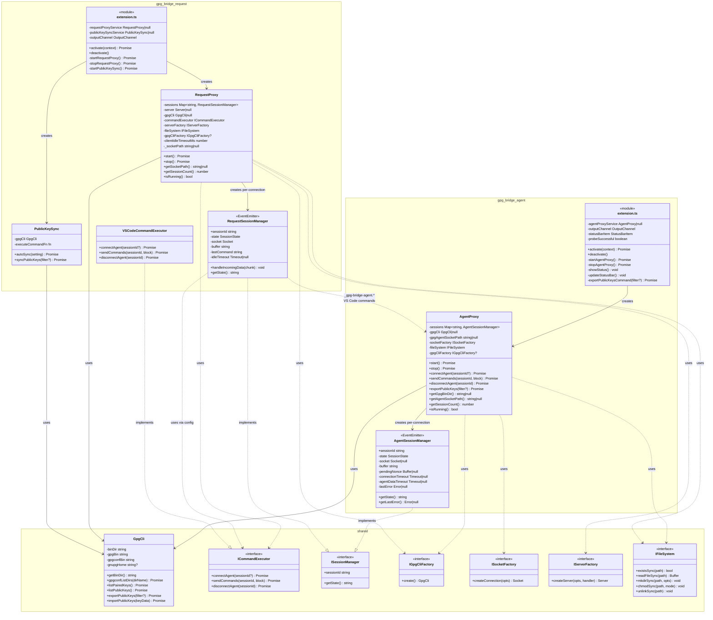

# Class Diagram

```mermaid
classDiagram
    namespace gpg_bridge_agent {
        class agent_extension["extension.ts"] {
            <<module>>
            -agentProxyService AgentProxy|null
            -outputChannel OutputChannel
            -statusBarItem StatusBarItem
            -probeSuccessful boolean
            +activate(context) Promise
            +deactivate()
            -startAgentProxy() Promise
            -stopAgentProxy() Promise
            -showStatus() void
            -updateStatusBar() void
            -exportPublicKeysCommand(filter?) Promise
        }

        class AgentProxy {
            -sessions Map~string‚ AgentSessionManager~
            -gpgCli GpgCli|null
            -gpgAgentSocketPath string|null
            -socketFactory ISocketFactory
            -fileSystem IFileSystem
            -gpgCliFactory IGpgCliFactory?
            +start() Promise
            +stop() Promise
            +connectAgent(sessionId?) Promise
            +sendCommands(sessionId, block) Promise
            +disconnectAgent(sessionId) Promise
            +exportPublicKeys(filter?) Promise
            +getGpgBinDir() string|null
            +getAgentSocketPath() string|null
            +getSessionCount() number
            +isRunning() bool
        }

        class AgentSessionManager {
            <<EventEmitter>>
            +sessionId string
            -state SessionState
            -socket Socket|null
            -buffer string
            -pendingNonce Buffer|null
            -connectionTimeout Timeout|null
            -agentDataTimeout Timeout|null
            -lastError Error|null
            +getState() string
            +getLastError() Error|null
        }
    }

    namespace gpg_bridge_request {
        class request_extension["extension.ts"] {
            <<module>>
            -requestProxyService RequestProxy|null
            -publicKeySyncService PublicKeySync|null
            -outputChannel OutputChannel
            +activate(context) Promise
            +deactivate()
            -startRequestProxy() Promise
            -stopRequestProxy() Promise
            -startPublicKeySync() Promise
        }

        class RequestProxy {
            -sessions Map~string‚ RequestSessionManager~
            -server Server|null
            -gpgCli GpgCli|null
            -commandExecutor ICommandExecutor
            -serverFactory IServerFactory
            -fileSystem IFileSystem
            -gpgCliFactory IGpgCliFactory?
            -clientIdleTimeoutMs number
            -_socketPath string|null
            +start() Promise
            +stop() Promise
            +getSocketPath() string|null
            +getSessionCount() number
            +isRunning() bool
        }

        class RequestSessionManager {
            <<EventEmitter>>
            +sessionId string
            -state SessionState
            -socket Socket
            -buffer string
            -lastCommand string
            -idleTimeout Timeout|null
            +handleIncomingData(chunk) void
            +getState() string
        }

        class VSCodeCommandExecutor {
            +connectAgent(sessionId?) Promise
            +sendCommands(sessionId, block) Promise
            +disconnectAgent(sessionId) Promise
        }

        class PublicKeySync {
            -gpgCli GpgCli
            -executeCommandFn fn
            +autoSync(setting) Promise
            +syncPublicKeys(filter?) Promise
        }
    }

    namespace shared {
        class GpgCli {
            -binDir string
            -gpgBin string
            -gpgconfBin string
            -gnupgHome string?
            +getBinDir() string
            +gpgconfListDirs(dirName) Promise
            +listPairedKeys() Promise
            +listPublicKeys() Promise
            +exportPublicKeys(filter?) Promise
            +importPublicKeys(keyData) Promise
        }

        class ICommandExecutor {
            <<interface>>
            +connectAgent(sessionId?) Promise
            +sendCommands(sessionId, block) Promise
            +disconnectAgent(sessionId) Promise
        }

        class ISessionManager {
            <<interface>>
            +sessionId string
            +getState() string
        }

        class IGpgCliFactory {
            <<interface>>
            +create() GpgCli
        }

        class ISocketFactory {
            <<interface>>
            +createConnection(opts) Socket
        }

        class IServerFactory {
            <<interface>>
            +createServer(opts, handler) Server
        }

        class IFileSystem {
            <<interface>>
            +existsSync(path) bool
            +readFileSync(path) Buffer
            +mkdirSync(path, opts) void
            +chmodSync(path, mode) void
            +unlinkSync(path) void
        }
    }

    %% ── gpg-bridge-agent ────────────────────────────────────────────────────
    agent_extension --> AgentProxy : creates
    AgentProxy --> AgentSessionManager : creates per-connection
    AgentProxy --> GpgCli : uses
    AgentProxy ..> ISocketFactory : uses
    AgentProxy ..> IFileSystem : uses
    AgentProxy ..> IGpgCliFactory : uses
    AgentSessionManager ..|> ISessionManager : implements

    %% ── gpg-bridge-request ──────────────────────────────────────────────────
    request_extension --> RequestProxy : creates
    request_extension --> PublicKeySync : creates
    RequestProxy --> RequestSessionManager : creates per-connection
    RequestProxy --> GpgCli : uses
    RequestProxy ..> ICommandExecutor : uses
    RequestProxy ..> IServerFactory : uses
    RequestProxy ..> IFileSystem : uses
    RequestProxy ..> IGpgCliFactory : uses
    RequestSessionManager ..|> ISessionManager : implements
    RequestSessionManager ..> ICommandExecutor : uses via config
    VSCodeCommandExecutor ..|> ICommandExecutor : implements
    PublicKeySync --> GpgCli : uses

    %% ── cross-extension ─────────────────────────────────────────────────────
    RequestSessionManager ..> AgentProxy : _gpg-bridge-agent.*<br/>VS Code commands
```
