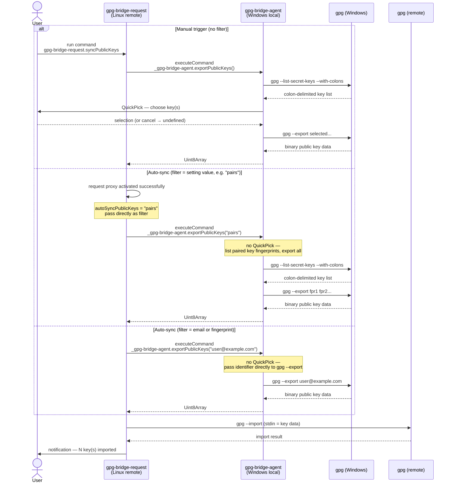

# Feature Plan: Public Key Sync

## Problem

When connecting to a remote (SSH dev container, WSL, etc.) and installing both GPG Bridge
extensions, the Assuan protocol bridge works correctly — signing and decryption operations
are forwarded to the Windows GPG agent. However, GPG operations that require resolving a
key ID (e.g., `git log --show-signature`, `gpg --list-keys`, signing with an explicit key)
fail because the remote's public keyring (`~/.gnupg/pubring.kbx`) is empty.

The Windows GPG agent holds private key stubs. The public key material lives in the Windows
keyring (`pubring.kbx`) and is not accessible through the Assuan protocol bridge as-is.

## Architecture context

`gpg-bridge-agent` runs **on Windows** (local VS Code extension host — enforced by
`process.platform !== 'win32'` guard). It can spawn subprocesses on Windows via
`child_process`.

`gpg-bridge-request` runs **on the remote** (remote VS Code extension host — Linux,
WSL, container). It can spawn subprocesses on the remote via its `commandExecutor`.

They communicate across the host boundary via `vscode.commands.executeCommand`, which VS Code
routes between local and remote extension hosts transparently.

This means: agent can run `gpg --export` on Windows, request can run `gpg --import` on the
remote, and binary key data passes through the existing cross-host command channel.

## Behaviour spec

**New command** (visible in command palette): `gpg-bridge-request.syncPublicKeys` — sync
public keys from the Windows keyring to the remote keyring.
- Manual trigger: shows a multi-select QuickPick (agent-side) listing your key pairs as
  `<User-ID> [<short-key-ID>]` (e.g. `Alice <alice@example.com> [A1B2C3D4]`); user picks
  one or more keys to sync
- Auto-sync setting: `gpgBridgeRequest.autoSyncPublicKeys` (string, default `""`) — when
  non-empty, runs automatically **once on extension activation** using that value as
  the filter (see below); no QuickPick in auto-sync; does not re-run on proxy stop/restart
- Keys are left in the remote keyring after the session ends (no cleanup on deactivate)
- Direction: Windows → remote only
- Returns `undefined` if the user cancels the QuickPick; request treats that as a no-op

### `KeyFilter` — the filter parameter

The internal command `_gpg-bridge-agent.exportPublicKeys(filter?: KeyFilter)` accepts:

| Value | Behaviour |
|---|---|
| *(omitted)* | Shows interactive QuickPick; user selects from your key pairs |
| `"all"` | Headless — exports all public keys in the Windows keyring |
| `"pairs"` | Headless — exports public keys for all your key pairs (uses `gpg --list-secret-keys` internally) |
| any other string | Headless — treated as a GPG identifier (email, fingerprint, key ID, etc.) passed directly to `gpg --export` |

The `gpgBridgeRequest.autoSyncPublicKeys` setting value is passed as-is to `exportPublicKeys`.
Suggested values (`"all"`, `"pairs"`) are shown as enum hints in VS Code settings UI, but
any string is valid (email address, fingerprint, etc.). Empty string disables auto-sync.

---

## Implementation approach

The user-facing command still lives on the **remote** (request) extension. However, a single
new internal command `_gpg-bridge-agent.exportPublicKeys` encapsulates all Windows-side work:
it lists paired keys, shows the QuickPick, exports the selected keys, and returns the binary
data in one call. Request receives the `Uint8Array` and runs `gpg --import` locally.

One new internal command is added to `gpg-bridge-agent`:
- `_gpg-bridge-agent.exportPublicKeys(filter?: KeyFilter)` → conditionally shows QuickPick,
  runs `gpg --export`, returns `Uint8Array` (or `undefined` if user cancels)

`KeyFilter` is a shared type: `'all' | 'pairs' | string`. See the Behaviour spec above.



**Pros**
- Single round-trip across the host boundary regardless of filter
- All Windows-side logic (list, QuickPick, export) is encapsulated inside one agent command
- `--with-colons` parsing stays in the agent — no shared parsing logic needed in request
- Request code is minimal: read setting → call command → receive data → import
- Consistent call direction: request → agent only
- `autoSyncPublicKeys` setting value maps directly to the `filter` param — no translation

**Cons**
- Agent command has a side effect (may show QuickPick UI) — less pure than a data-only command
- Two behavioural modes in one command (interactive vs. headless) — distinguished by presence
  of `filter` argument

---

## New files / changes

| File | Change |
|------|--------|
| `shared/src/gpgCli.ts` | New: production `GpgCli` base class — `PairedKeyInfo` interface; private `detect()`, `getBinDir()`, `gpgconfListDirs`, `listPairedKeys`, `exportPublicKeys`, `importPublicKeys`; optional `gnupgHome` opt; `protected run()`/`runRaw()` |
| `shared/package.json` | Add `which` production dependency (synchronous PATH probing in `GpgCli` constructor) |
| `shared/src/index.ts` | Re-export `GpgCli`, `GpgCliOpts`, and `PairedKeyInfo` |
| `shared/src/types.ts` | Add `KeyFilter` type (`'all' \| 'pairs' \| string`) |
| `shared/src/test/integration/gpgCli.ts` | Rename `GpgCli` → `GpgTestHelper`; extend production `GpgCli`; constructor (no required args) creates isolated temp dir via `mkdtempSync`, calls `assertSafeToDelete`, passes it as `gnupgHome` to `super()`, exposes `readonly gnupgHome: string` property and `async cleanup()` method; does **not** mutate `process.env`; remove duplicated subprocess infrastructure |
| `shared/src/test/integration/index.ts` | Update export: `GpgTestHelper` (and its opts/result types) |
| `gpg-bridge-agent/src/services/agentProxy.ts` | Add `gpgCliFactory?: () => GpgCli` to `AgentProxyDeps`; add module-level `gpgCli: GpgCli \| null`; add exported async `resolveSocketPath(gpgBinDir: string, deps?)` (constructs `GpgCli`, calls `gpgconfListDirs('agent-extra-socket')`, returns path) and exported `getGpgBinDir(): string \| null` |
| `gpg-bridge-agent/src/extension.ts` | Remove `detectGpgBinDir()`, `resolveAgentSocketPath()`, `detectedGpgBinDir`, `resolvedAgentSocketPath`; `startAgentProxy()` stays — reads `gpgBinDir` setting, calls `agentProxy.resolveSocketPath(gpgBinDir)`, passes result to `new AgentProxy({ gpgAgentSocketPath: ... })`; `showStatus()` calls `agentProxy.getGpgBinDir()`; register `_gpg-bridge-agent.exportPublicKeys` internal command |
| `gpg-bridge-agent/src/services/publicKeyExport.ts` | New: `exportPublicKeys(filter?: KeyFilter)` — QuickPick when no filter, headless otherwise; uses `GpgCli` |
| `gpg-bridge-request/src/extension.ts` | Register `gpg-bridge-request.syncPublicKeys` user command; hook auto-sync into activation |
| `gpg-bridge-request/src/services/publicKeySync.ts` | New: read filter from setting, call `_gpg-bridge-agent.exportPublicKeys`, run `gpgcli.importPublicKeys` locally |
| `gpg-bridge-request/src/services/requestProxy.ts` | Replace inline `spawnSync` in `getLocalGpgSocketPath()` with `gpgcli.gpgconfListDirs()`; socket file removal logic stays |
| `gpg-bridge-request/package.json` | Add `gpg-bridge-request.syncPublicKeys` to `contributes.commands`; add `gpgBridgeRequest.autoSyncPublicKeys` string setting (default `""`) with `"all"` and `"pairs"` as enum suggestions |
| All integration test files | Update `GpgCli` → `GpgTestHelper` at call sites |

## Shared `gpg` subprocess code

Both extensions already call `gpgconf` with nearly identical `spawnSync` patterns, and the
new feature adds `gpg --export` on the agent side and `gpg --import` on the request side —
a natural export/import pair. The overlap is real enough to extract:

| Extension | Existing subprocess calls | New subprocess calls |
|---|---|---|
| Agent | `gpgconf --list-dirs agent-extra-socket` | `gpg --list-secret-keys --with-colons`; `gpg --export [filter]` |
| Request | `gpgconf --list-dirs agent-socket`; `gpgconf --list-dirs agent-extra-socket` | `gpg --import` (stdin) |

The existing test `GpgCli` in `shared/src/test/integration/gpgCli.ts` already does many of
these operations, but with GNUPGHOME injection for keyring isolation, agent lifecycle
methods, and timeout/buffer parameters sized for stress tests. Using it directly in
production code is not appropriate — but duplicating the subprocess infrastructure is also
not appropriate.

**Decision**: production `GpgCli` as base class + test class renamed and extended.

### `GpgCli` — production base (`shared/src/gpgCli.ts`)

```typescript
/** One entry per key pair you own (parsed from `gpg --list-secret-keys --with-colons`). */
export interface PairedKeyInfo {
    fingerprint: string;  // 40-char hex primary key fingerprint
    userIds: string[];    // one or more UID strings (e.g. 'Alice <alice@example.com>')
}

export interface GpgCliOpts {
    gpgBinDir?: string;     // absolute directory path containing gpg and gpgconf;
                            // if omitted or '', detection runs at construction time
    gnupgHome?: string;     // if set, injected as GNUPGHOME in all subprocess calls
}

export class GpgCli {
    constructor(opts?: GpgCliOpts) {
        // If gpgBinDir is provided, validate it.
        // If empty/omitted, run private detection:
        //   1. which('gpgconf') — respects PATH, cross-platform
        //   2. probe well-known Windows Gpg4win locations (Windows only)
        // Throws at construction if no gpgconf can be found.
    }

    /** Return the resolved bin directory (useful for status display). */
    getBinDir(): string

    /** gpgconf --list-dirs <dirName> → trimmed path string */
    gpgconfListDirs(dirName: string): Promise<string>

    /** gpg --list-secret-keys --with-colons → one entry per key pair you own */
    listPairedKeys(): Promise<PairedKeyInfo[]>

    /** gpg --export [filter] → binary Uint8Array */
    exportPublicKeys(filter?: string): Promise<Uint8Array>

    /** gpg --import (stdin via `execFile` `input:` option — no temp file) → parsed result { imported: number; unchanged: number; errors: number } */
    importPublicKeys(keyData: Uint8Array): Promise<{ imported: number; unchanged: number; errors: number }>

    // protected run() / runRaw() helpers (available to subclasses)

    private detect(): string   // runs PATH probe then well-known path probe; throws if nothing found
}
```

**Detection is private and runs once at construction.** The constructor is synchronous, so
detection uses synchronous probing:

1. If `gpgBinDir` provided: verify `gpgconf[.exe]` exists in that directory. Throw if not.
2. If empty/omitted:
   1. Try `whichSync('gpgconf')` — resolves from `PATH`, cross-platform, zero hardcoding.
      Returns the full binary path; `getBinDir()` returns `path.dirname()` of that.
   2. If `which` misses (returns null), probe well-known Windows Gpg4win directories with
      `fs.existsSync` (same list as the current `detectGpgBinDir()` function).
   3. Throw if nothing found.

`which` is a small, widely-used npm package already common in Node tooling. Since `whichSync`
is synchronous, no `async` constructor is needed. The `which` package is added as a
production dependency of `shared`.

Binary name resolution is internal: `path.join(binDir, process.platform === 'win32' ? 'gpg.exe' : 'gpg')`.

**`getBinDir()`** returns the resolved bin dir string. This replaces the module-level
`detectedGpgBinDir` variable in `gpg-bridge-agent/src/extension.ts` — the status dialog
calls `gpgCli.getBinDir()` instead of reading the module variable.

Typical agent-side usage, following Decision 12 (`GpgCli` construction in the service layer):

```typescript
// agentProxy.ts (service layer) — module-level
// GpgCli is owned here, not in extension.ts
let gpgCli: GpgCli | null = null;

// Exported: constructs GpgCli (service layer), resolves socket path.
// Called by extension.ts startAgentProxy() in place of detectGpgBinDir() + resolveAgentSocketPath().
// deps.gpgCliFactory allows unit tests to inject a mock.
export async function resolveSocketPath(
    gpgBinDir: string,
    deps?: Pick<AgentProxyDeps, 'gpgCliFactory'>
): Promise<string> {
    gpgCli = deps?.gpgCliFactory?.() ?? new GpgCli({ gpgBinDir });  // throws if gpgconf not found
    return gpgCli.gpgconfListDirs('agent-extra-socket');
}

export function resetGpgCli(): void {
    gpgCli = null;
}

// Exported: called by extension.ts showStatus()
export function getGpgBinDir(): string | null {
    return gpgCli?.getBinDir() ?? null;
}
```

```typescript
// extension.ts — stays as-is structurally; replaces detectGpgBinDir() + resolveAgentSocketPath()
async function startAgentProxy(): Promise<void> {
    const gpgBinDir = vscode.workspace.getConfiguration('gpgBridgeAgent').get<string>('gpgBinDir') ?? '';
    const socketPath = await agentProxy.resolveSocketPath(gpgBinDir);  // GpgCli constructed in service layer
    agentProxyService = new AgentProxy({ gpgAgentSocketPath: socketPath, logCallback, statusBarCallback });
}

function stopAgentProxy(): void {
    agentProxy.resetGpgCli();
    agentProxyService = null;
}

function showStatus(): void {
    const gpgBinDir = agentProxy.getGpgBinDir() ?? '(not detected)';
    // ...
}
```

`AgentProxyConfig.gpgAgentSocketPath` is unchanged — `AgentProxy` still receives the resolved path,
just computed by `agentProxy.resolveSocketPath()` instead of the old `extension.ts` helpers.

### `GpgTestHelper extends GpgCli` — test subclass (renamed, same file location)

The existing `GpgCli` in `shared/src/test/integration/gpgCli.ts` is **renamed** to
`GpgTestHelper`. It extends `GpgCli` from the production package:

```typescript
// shared/src/test/integration/gpgCli.ts
import * as fs from 'fs';
import * as os from 'os';
import * as path from 'path';
import { GpgCli } from '@gpg-bridge/shared';
import { assertSafeToDelete } from './helpers';

export class GpgTestHelper extends GpgCli {
    /** Absolute path to the isolated temp keyring created by this instance. */
    public readonly gnupgHome: string;

    /** Optional — override only when gpg is not on PATH (e.g. specific Gpg4win install). */
    constructor(opts?: { gpgBinDir?: string }) {
        const gnupgHome = fs.mkdtempSync(path.join(os.tmpdir(), 'gpg-test-integration-'));
        assertSafeToDelete(gnupgHome);
        // gnupgHome is passed to super() so it is injected explicitly into every subprocess
        // call — process.env.GNUPGHOME is never mutated, keeping tests side-effect-free.
        super({ gpgBinDir: opts?.gpgBinDir, gnupgHome });
        this.gnupgHome = gnupgHome;
    }

    /**
     * Kill the gpg-agent (tolerates already-dead agent), validate the temp dir
     * path, then delete it. Always call in a finally block.
     */
    async cleanup(): Promise<void> {
        await this.killAgent();
        assertSafeToDelete(this.gnupgHome);
        fs.rmSync(this.gnupgHome, { recursive: true, force: true });
    }

    // Inherits: getBinDir, gpgconfListDirs, listPairedKeys, exportPublicKeys, importPublicKeys
    // Adds: writeAgentConf, launchAgent, killAgent, cleanup, generateKey, deleteKey,
    //        getFingerprint, getKeygrip, exportPublicKey (armor), version,
    //        listKeys, signFile, verifyFile, encryptFile, decryptFile
}
```

- No code duplication: all subprocess helpers come from the base class
- `gnupgHome` is passed to `super()` and injected explicitly into every subprocess env — `process.env.GNUPGHOME` is never mutated, so tests are side-effect-free
- Timeouts / maxBuffer overridden where needed (or accepted as-is if 5 s is fine for tests)
- All existing integration test call sites change `GpgCli` → `GpgTestHelper`; behaviour
  is identical

The existing `requestProxy.ts` `getLocalGpgSocketPath()` (which wraps `spawnSync` in a
needless `Promise` constructor) and the agent's `resolveAgentSocketPath()` are both
refactored to use `GpgCli.gpgconfListDirs()` instead.

## Decisions

1. **`gpg` binary path on Windows**: `GpgCli` constructor handles auto-detection; the agent
   extension passes the VS Code `gpgBridgeAgent.gpgBinDir` setting directly — no additional
   setting or path plumbing needed.
2. **`gpg` binary path on remote**: rely on `PATH` resolution for now; add a
   `gpgBridgeRequest.gpgBinDir` setting later only if a user reports a non-`PATH` install.
3. **`GpgCli` testability**: inject a mock `GpgCli` instance via the `*Deps` pattern for
   unit tests of `publicKeyExport.ts` and `publicKeySync.ts` (same pattern as `socketFactory`,
   `serverFactory`, etc.). Integration tests use `GpgTestHelper extends GpgCli` against an
   isolated keyring.
4. **Empty export result**: if `gpg --export <identifier>` returns zero bytes, the **agent**
   shows a VS Code warning message and returns `undefined` — keeping all UI agent-side; do
   not throw.
5. **User cancels QuickPick**: return `undefined`; request treats as a silent no-op.
6. **Key data size**: public keys are small (< 10 KB each); `Uint8Array` through the VS Code
   command channel is sufficient — no streaming needed.
7. **Notification placement**: show both a VS Code information message and write to the output
   channel after a successful import.
8. **QuickPick format**: multi-select; each item displays `<User-ID> [<short-key-ID>]`
   (e.g. `Alice <alice@example.com> [A1B2C3D4]`). User may select one or more items.
9. **Import result parsing**: `GpgCli.importPublicKeys()` parses `gpg --import` stdout and
   returns `{ imported: number; unchanged: number; errors: number }`. The caller
   (`publicKeySync.ts`) uses this struct to build the notification message.
10. **Auto-sync trigger**: fires once on **extension activation** (not on each proxy
    start/stop). Implemented as a separate `onActivate` call in
    `gpg-bridge-request/src/extension.ts`, independent of `startRequestProxy()`.
11. **Agent extension absent**: if `_gpg-bridge-agent.exportPublicKeys` is unavailable
    (extension not installed or not active), `syncPublicKeys` catches the rejection and
    shows a user-facing VS Code error message.
12. **`GpgCli` DI placement**: `GpgCli` construction lives inside the service layer
    (`agentProxy.ts`, `requestProxy.ts`), not in `extension.ts`. A `gpgCliFactory?: () => GpgCli`
    field is added to each service's `*Deps` interface; unit tests inject a factory returning
    a mock; production code falls through to `new GpgCli(...)`.
13. **`importPublicKeys` stdin mechanism**: key data is passed via `execFile`'s `input:` option
    — no temp file written to disk.
14. **QuickPick multi-UID keys**: display `userIds[0]` (the first UID) only. A key with no
    UIDs is skipped in the QuickPick list; it can still be exported headlessly by fingerprint.
15. **`exportPublicKeys` name collision**: `GpgCli` has a method `exportPublicKeys()` and
    `publicKeyExport.ts` exports a function also named `exportPublicKeys`. This is intentional
    — file scope makes the distinction clear; no rename needed.
16. **Phase 4 integration tests share the existing agent suite runner**: `publicKeyExport.test.ts`
    is added to `gpg-bridge-agent/test/integration/suite/index.ts`; no new runner or VS Code launch.

---

## Work phases

Each phase ends with: all new unit tests + all new integration tests + all pre-existing unit
and integration tests pass → update this plan (mark checkboxes) → git commit.

---

### Phase 1 — `GpgCli` production base class (`shared`) ✅ complete

**Files changed**: `shared/src/gpgCli.ts` (new), `shared/src/types.ts`, `shared/src/index.ts`,
`shared/package.json`

#### Work items
- [x] Add `which` as a production dependency in `shared/package.json`
- [x] Create `shared/src/gpgCli.ts` with `GpgCliOpts` interface and `GpgCli` class skeleton
- [x] Implement private `detect()`: `whichSync('gpgconf')` → PATH probe; fall back to
  well-known Windows Gpg4win directories; throw if not found
- [x] Implement constructor: accept `gpgBinDir` opt (validate) or run `detect()`; accept
  `gnupgHome` opt; store resolved paths
- [x] Implement `getBinDir(): string`
- [x] Implement `protected run()` / `runRaw()` helpers (spawn with optional `GNUPGHOME`)
- [x] Implement `gpgconfListDirs(dirName: string): Promise<string>`
- [x] Implement `listPairedKeys(): Promise<PairedKeyInfo[]>` (parses `--with-colons` output: `fpr:` records for fingerprints, `uid:` records for user IDs)
- [x] Re-export `PairedKeyInfo` from `shared/src/index.ts`
- [x] Implement `exportPublicKeys(filter?: string): Promise<Uint8Array>`
- [x] Implement `importPublicKeys(keyData: Uint8Array): Promise<{ imported; unchanged; errors }>`
  (pipes `keyData` to `gpg --import` stdin via `spawn`; parses `gpg --import` stderr; no temp file)
- [x] Add `KeyFilter = 'all' | 'pairs' | string` to `shared/src/types.ts`
- [x] Re-export `GpgCli`, `GpgCliOpts`, `KeyFilter` from `shared/src/index.ts`

#### Test cases

Tests are split into two groups:

**Unit tests** (`shared/src/test/gpgCli.test.ts`, new — mocked subprocesses, no real gpg required, no keyring access):
- [x] `GpgCli` constructor throws when `gpgBinDir` points to a directory without `gpgconf[.exe]`
- [x] `GpgCli` constructor succeeds when `gpgBinDir` is valid (filesystem check only, mock `fs.existsSync`)
- [x] `getBinDir()` returns the resolved directory
- [x] `gpgconfListDirs` returns trimmed path string (mock subprocess)
- [x] `gpgconfListDirs` throws on non-zero exit (mock subprocess)
- [x] `listPairedKeys` parses `--with-colons` output correctly — returns `PairedKeyInfo[]` with correct fingerprints and userIds (mock subprocess output)
- [x] `listPairedKeys` returns empty array for empty `--with-colons` output (mock subprocess)
- [x] `exportPublicKeys` returns `Uint8Array` of key data (mock subprocess)
- [x] `exportPublicKeys` returns empty `Uint8Array` when subprocess produces no output (mock subprocess)
- [x] `importPublicKeys` parses stdout: `{ imported: 1, unchanged: 0, errors: 0 }` (mock subprocess)
- [x] `importPublicKeys` parses stdout: already-imported key `{ imported: 0, unchanged: 1, errors: 0 }` (mock subprocess)
- [x] `GNUPGHOME` is injected into every subprocess call when `gnupgHome` opt is set (mock subprocess)
- [x] `GNUPGHOME` is absent from subprocess env when `gnupgHome` opt is not set (mock subprocess)

**Integration tests** (`shared/src/test/integration/gpgCli.test.ts`, new — real gpg subprocesses; `GpgTestHelper` does not exist yet;
tests set up the isolated keyring manually: `mkdtempSync` → `assertSafeToDelete` →
`new GpgCli({ gnupgHome: tmpHome })` → delete in `afterEach`; this boilerplate is
replaced by `new GpgTestHelper()` in Phase 2):
- [x] `GpgCli` constructor succeeds with no opts (real PATH probe finds `gpgconf`)
- [x] `gpgconfListDirs('agent-socket')` returns a valid path string against the isolated keyring
- [x] `listPairedKeys` returns `PairedKeyInfo[]` with correct fingerprints and userIds for keys generated in the isolated keyring
- [x] `exportPublicKeys('pairs')` round-trip: exported bytes are non-empty for a key pair in the isolated keyring
- [x] `importPublicKeys` round-trip: export from one isolated keyring, import into a second isolated keyring; result `imported: 1`

---

### Phase 2 — `GpgTestHelper` refactor (`shared` integration tests) ✅ complete

**Files changed**: `shared/src/gpgCli.ts`, `shared/src/index.ts`,
`shared/src/test/integration/gpgCli.ts`, `shared/src/test/integration/index.ts`,
`shared/src/test/integration/gpgCli.test.ts`,
`gpg-bridge-agent/test/integration/agentProxyIntegration.test.ts`,
`gpg-bridge-request/test/integration/gpgCliIntegration.test.ts`,
all three integration test runner files

#### Work items
- [x] Rename class `GpgCli` → `GpgTestHelper` in `shared/src/test/integration/gpgCli.ts`
- [x] Change `GpgTestHelper` to `extends GpgCli` (import from `@gpg-bridge/shared`)
- [x] Update constructor: `mkdtempSync` → `assertSafeToDelete` → `super({ gnupgHome })`; expose as `public readonly gnupgHome: string`; do **not** mutate `process.env.GNUPGHOME`
- [x] Add `async cleanup()`: `killAgent()` → `assertSafeToDelete` → `fs.rmSync`
- [x] Remove all duplicated subprocess infrastructure now inherited from `GpgCli`
- [x] Update `shared/src/test/integration/index.ts`: export `GpgTestHelper`
- [x] Update all integration test call sites in Mocha test files: `new GpgCli(...)` → `new GpgTestHelper()`
- [x] Update all three integration test runner files (`gpg-bridge-agent/test/integration/runTest.ts`,
  `gpg-bridge-request/test/integration/requestProxyRunTest.ts`,
  `gpg-bridge-request/test/integration/gpgCliRunTest.ts`):
  - Remove top-level `const GNUPGHOME = fs.mkdtempSync(...)`, `assertSafeToDelete(GNUPGHOME)`,
    and `process.env.GNUPGHOME = GNUPGHOME` boilerplate — constructor now handles creation
  - Change `const gpg = new GpgCli()` → `const gpg = new GpgTestHelper()`
  - Remove imports of `fs`, `os`, `assertSafeToDelete` that are no longer needed at top level
  - Replace `GNUPGHOME` constant with `gpg.gnupgHome` in `extensionTestsEnv` and anywhere else it is referenced
  - Replace `finally` block (manual `killAgent()` + `assertSafeToDelete` + `fs.rmSync`) with `await gpg.cleanup()`
- [x] Export `ExecFileError` and `GpgExecResult` interfaces from `shared/src/gpgCli.ts` and re-export from `shared/src/index.ts`
- [x] Unify `run()` and `runRaw()` return types to `Promise<GpgExecResult>`; update `ExecFileFn` to return `Promise<Pick<GpgExecResult, 'stdout' | 'stderr'>>` and `SpawnForStdinFn` to return `Promise<GpgExecResult>`
- [x] Make `gpgBin` and `gpgconfBin` `protected` so `GpgTestHelper` subclass can invoke them
- [x] Use `GpgCliOpts` (imported from `@gpg-bridge/shared`) as the constructor parameter type instead of an inline type
- [x] Extend `GpgTestHelper` constructor to accept optional `opts.gnupgHome` (via `GpgCliOpts`): when provided, wraps an existing keyring without taking ownership (`_ownsTempDir = false`) and `cleanup()` is a no-op; when omitted, behaviour is unchanged (`mkdtempSync`, full cleanup)
- [x] Fix `gpg-bridge-agent/test/integration/agentProxyIntegration.test.ts`: was importing `GpgCli` from test barrel; changed to `GpgTestHelper` constructed with `{ gnupgHome: process.env.GNUPGHOME! }` so it wraps the keyring prepared by `runTest.ts` without owning its lifecycle
- [x] Fix `gpg-bridge-request/test/integration/gpgCliIntegration.test.ts`: same issue — changed to `GpgTestHelper` constructed with `{ gnupgHome: LINUX_GNUPGHOME }`
- [x] Remove duplicate Phase 1 test blocks from `shared/src/test/integration/gpgCli.test.ts` (all superseded by Phase 2 block); merge best assertions from each into the surviving Phase 2 tests:
  - `gpgconfListDirs('agent-socket')`: add absolute path check from Phase 1
  - `listPairedKeys()` with key: add explicit `userIds.length === 1` and error messages from Phase 1
  - `exportPublicKeys()`: add error message; tighten `length > 0` → `length >= 300` (minimum for Ed25519+cv25519 binary packet)
  - `importPublicKeys()`: add `keyData.length >= 300` pre-check; add `JSON.stringify` in error messages from Phase 1
  - `listPairedKeys()` count: tighten `>= 1` → `=== 1` (isolated keyring, exactly one key generated)
  - Constructor tests: convert from synchronous `fs.rmSync` to `async`/`await helper.cleanup()`

#### Test cases

**Integration tests** (real gpg; each test constructs its own `GpgTestHelper()` which
creates an isolated temp dir automatically; `cleanup()` removes it in `afterEach`):
- [x] `new GpgTestHelper()` sets `gnupgHome` to a non-empty string pointing to a real temp directory
- [x] `new GpgTestHelper()` does **not** mutate `process.env.GNUPGHOME`
- [x] `getBinDir()` returns a non-empty string (confirms detection resolved a real gpg install)
- [x] `gpgconfListDirs('homedir')` returns the same path as `gnupgHome` (confirms GNUPGHOME injection)
- [x] `gpgconfListDirs('agent-socket')` returns a non-empty absolute path string
- [x] `listPairedKeys()` returns an empty array on a fresh empty keyring
- [x] `listPairedKeys()` returns exactly one `PairedKeyInfo` with correct fingerprint and userId for a single generated key
- [x] `exportPublicKeys()` returns `Uint8Array` of at least 300 bytes for a key pair (Ed25519+cv25519 minimum)
- [x] `importPublicKeys()` imports exported bytes (>= 300 bytes) into a second `new GpgTestHelper()` keyring; result has `imported: 1`, `errors: 0`
- [x] `cleanup()` removes the temp directory

---

### Phase 3 — Agent extension: replace detection with `GpgCli`

**Files changed**: `gpg-bridge-agent/src/services/agentProxy.ts`, `gpg-bridge-agent/src/extension.ts`

#### Work items
- [ ] Add `gpgCliFactory?: () => GpgCli` to `AgentProxyDeps` in `agentProxy.ts`
- [ ] Add `gpgCli: GpgCli | null` module-level variable in `agentProxy.ts`
- [ ] Extract `startAgentProxy(gpgBinDir: string, deps?: AgentProxyDeps)` from `extension.ts` to
  `agentProxy.ts` as a named export; construct `GpgCli` here via `deps.gpgCliFactory?.()` or
  `new GpgCli({ gpgBinDir })`; call `gpgCli.gpgconfListDirs('agent-extra-socket')` here to get
  the socket path; pass it to `new AgentProxy({ gpgAgentSocketPath: socketPath, ... })`
- [ ] Extract `stopAgentProxy()` from `extension.ts` to `agentProxy.ts` as a named export;
  null out `gpgCli` and `agentProxyService` here
- [ ] Add `getGpgBinDir(): string | null` named export from `agentProxy.ts`
  (returns `gpgCli?.getBinDir() ?? null`)
- [ ] Update `extension.ts startAgentProxy()`: read `gpgBinDir` from VS Code config,
  call exported `agentProxy.startAgentProxy(gpgBinDir)`; remove `detectGpgBinDir()`,
  `resolveAgentSocketPath()`, `detectedGpgBinDir`, `resolvedAgentSocketPath`
- [ ] Update `extension.ts showStatus()`: call exported `agentProxy.getGpgBinDir() ?? '(not detected)'`

#### Test cases (`gpg-bridge-agent/src/test/agentProxy.test.ts`)

**Unit tests** (mocked `GpgCli` via `AgentProxyDeps.gpgCliFactory` — no real gpg required):
- [ ] `startAgentProxy` constructs `GpgCli` with the configured `gpgBinDir` setting value
- [ ] `startAgentProxy` passes empty string when setting is unset (triggers auto-detect inside `GpgCli`)
- [ ] `startAgentProxy` uses `gpgconfListDirs('agent-extra-socket')` result as the socket path
- [ ] `startAgentProxy` propagates `GpgCli` constructor throw (gpgconf not found → proxy fails to start)
- [ ] `stopAgentProxy` nulls out `gpgCli`
- [ ] `showStatus` returns `'(not detected)'` when `gpgCli` is null
- [ ] `showStatus` returns `getBinDir()` result when `gpgCli` is set

**Integration tests** (real gpg via `GpgTestHelper` on Windows — available after Phase 2; never touches the live keyring):
- [ ] `startAgentProxy` with no `gpgBinDir` setting: `GpgCli` auto-detects `gpgconf` on PATH
  or well-known Gpg4win location against the isolated keyring; no error thrown
- [ ] `gpgconfListDirs('agent-extra-socket')` returns a non-empty path string for the isolated keyring
- [ ] `getBinDir()` returns the directory that contains the real `gpgconf[.exe]`
- [ ] `stopAgentProxy` then `startAgentProxy` re-constructs `GpgCli` without stale state

---

### Phase 4 — Agent extension: `exportPublicKeys` command

**Files changed**: `gpg-bridge-agent/src/services/publicKeyExport.ts` (new),
`gpg-bridge-agent/src/extension.ts`

#### Work items
- [ ] Create `gpg-bridge-agent/src/services/publicKeyExport.ts`
- [ ] Implement headless path: `filter === 'pairs'` → `listPairedKeys()` →
  `exportPublicKeys(keys.map(k => k.fingerprint).join(' '))`
- [ ] Implement headless path: `filter === 'all'` → `exportPublicKeys()` (no args)
- [ ] Implement headless path: any other string → `exportPublicKeys(filter)` directly
- [ ] Implement interactive path: no filter → `listPairedKeys()` → build QuickPick items
  as `<User-ID> [<short-key-ID>]` from `PairedKeyInfo.userIds[0]` + last 8 chars of `fingerprint`
  → multi-select → `exportPublicKeys(selected.map(k => k.fingerprint).join(' '))`
- [ ] Handle user cancels QuickPick → return `undefined`
- [ ] Handle zero-byte export result → show VS Code warning message → return `undefined`
- [ ] Register `_gpg-bridge-agent.exportPublicKeys` internal command in `extension.ts`,
  wired to the service function

#### Test cases (`gpg-bridge-agent/src/test/publicKeyExport.test.ts`)

**Unit tests** (mocked `GpgCli` via `*Deps` — no real gpg required):
- [ ] `filter = 'pairs'`: calls `listPairedKeys()`, passes all fingerprints joined to `exportPublicKeys()`
- [ ] `filter = 'all'`: calls `exportPublicKeys()` with no args
- [ ] `filter = 'user@example.com'`: passes string directly to `exportPublicKeys()`
- [ ] `filter = undefined`: QuickPick is shown, populated with items from `listPairedKeys()`
- [ ] `filter = undefined`, user cancels QuickPick: returns `undefined`; `exportPublicKeys()` not called
- [ ] Zero-byte export result: VS Code warning message shown; returns `undefined`
- [ ] QuickPick items are formatted as `<User-ID> [<short-key-ID>]`
- [ ] Multi-select: all selected fingerprints are passed in a single `exportPublicKeys()` call

**Integration tests** (real gpg via `GpgTestHelper`; tests share the existing agent integration
suite runner `gpg-bridge-agent/test/integration/runTest.ts` — add `publicKeyExport.test.ts` to
`suite/index.ts` if the glob doesn't already support it; the GNUPGHOME and live gpg-agent are already in place):
- [ ] `filter = 'pairs'`: returns non-empty `Uint8Array` containing the test key pair's public key
- [ ] `filter = 'all'`: returns non-empty `Uint8Array`
- [ ] `filter = <test key fingerprint>`: returns non-empty `Uint8Array` matching that key
- [ ] `filter = 'unknown@nomatch.invalid'`: `gpg --export` returns zero bytes → warning shown; returns `undefined`

---

### Phase 5 — Request extension: refactor `getLocalGpgSocketPath`

**Files changed**: `gpg-bridge-request/src/services/requestProxy.ts`

#### Work items
- [ ] Add `gpgCliFactory?: () => GpgCli` to `RequestProxyDeps`; construct `gpgCli` inside `RequestProxy` via `deps.gpgCliFactory?.() ?? new GpgCli()`
- [ ] Replace inline `spawnSync` + `new Promise()` wrapper in `getLocalGpgSocketPath()` with
  `gpgcli.gpgconfListDirs('agent-socket')`
- [ ] Replace the `agent-extra-socket` `spawnSync` call in `requestProxy.ts` with
  `gpgcli.gpgconfListDirs('agent-extra-socket')`
- [ ] Verify socket file removal logic is unchanged

#### Test cases (`gpg-bridge-request/src/test/requestProxy.test.ts`)

**Unit tests** (mocked `GpgCli` via `*Deps` — no real gpg required):
- [ ] `getLocalGpgSocketPath` uses `gpgconfListDirs('agent-socket')` result as the returned path
- [ ] `getLocalGpgSocketPath` propagates errors thrown by `gpgconfListDirs`
- [ ] Socket file removal logic executes correctly (mock filesystem)

**Integration tests** (real gpg via `GpgTestHelper` on the remote host):
- [ ] `gpgconfListDirs('agent-socket')` returns a non-empty path string for the isolated keyring
- [ ] Socket file removal: create a temp file at the returned path; verify the cleanup logic removes it

---

### Phase 6 — Request extension: `syncPublicKeys` command and auto-sync

**Files changed**: `gpg-bridge-request/src/services/publicKeySync.ts` (new),
`gpg-bridge-request/src/extension.ts`, `gpg-bridge-request/package.json`

#### Work items
- [ ] Create `gpg-bridge-request/src/services/publicKeySync.ts`
- [ ] Implement `syncPublicKeys(filter?: KeyFilter)`: call
  `executeCommand('_gpg-bridge-agent.exportPublicKeys', filter)` → if `undefined`, no-op →
  else call `gpgcli.importPublicKeys(data)` → show info message + log to output channel
- [ ] Handle `executeCommand` rejection (agent absent): show VS Code error message
- [ ] Register `gpg-bridge-request.syncPublicKeys` user command in `extension.ts`
- [ ] Add auto-sync `onActivate` hook in `extension.ts`: if `autoSyncPublicKeys` setting is
  non-empty, call `syncPublicKeys(settingValue)` once on activation
- [ ] Add `gpg-bridge-request.syncPublicKeys` to `contributes.commands` in `package.json`
- [ ] Add `gpgBridgeRequest.autoSyncPublicKeys` string setting in `package.json` (default
  `""`, enum suggestions `"all"` and `"pairs"`, with descriptions)

#### Test cases (`gpg-bridge-request/src/test/publicKeySync.test.ts`)

**Unit tests** (mocked `GpgCli` and mocked `executeCommand` — no real gpg or cross-host call):
- [ ] Manual trigger with no `autoSyncPublicKeys` setting: calls `executeCommand('_gpg-bridge-agent.exportPublicKeys')` with no filter
- [ ] Auto-sync with `autoSyncPublicKeys = "pairs"`: calls `executeCommand` with `"pairs"` as filter
- [ ] Auto-sync with `autoSyncPublicKeys = "all"`: calls `executeCommand` with `"all"` as filter
- [ ] Auto-sync with `autoSyncPublicKeys = "user@example.com"`: calls `executeCommand` with the email as filter
- [ ] `executeCommand` returns `undefined` (user cancelled / empty export): `importPublicKeys` not called; no error
- [ ] Successful import: `importPublicKeys` is called with the `Uint8Array`; VS Code info message shown; result written to output channel
- [ ] Agent absent (`executeCommand` rejects): VS Code error message shown; no import attempted
- [ ] Auto-sync does not fire when `autoSyncPublicKeys` is empty string
- [ ] Auto-sync fires exactly once at activation; a subsequent proxy stop/restart does not re-trigger it

**Integration tests** (real gpg via `GpgTestHelper` on the remote host; `executeCommand`
stubbed to supply key bytes — the cross-host VS Code bridge cannot be replicated in automated tests,
but the gpg import subprocess is real and isolated):
- [ ] Import round-trip: stub `executeCommand` to return the key bytes exported in Phase 4
  integration tests; `importPublicKeys` runs real `gpg --import` against the isolated remote
  keyring; result has `imported: 1`; key appears in that keyring
- [ ] Re-import of the same key against the same isolated keyring: result has `unchanged: 1, imported: 0`
- [ ] VS Code info message content includes the correct imported count from the parsed result
