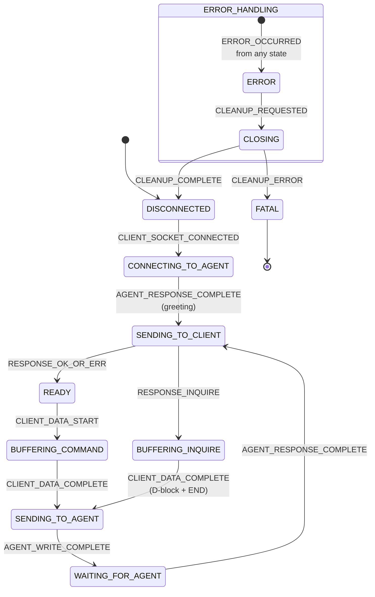

# GPG Bridge Request — Internal Architecture

Developer reference for `gpg-bridge-request`. Covers the state machine, public API,
session management, INQUIRE D-block buffering, testing approach, and error handling.

See also:

- [AGENTS.md](../AGENTS.md) — project-wide coding conventions and state machine pattern
- [docs/request-state-machine-refactor.md](request-state-machine-refactor.md) — original refactor plan
- [docs/gpg-agent-protocol.md](gpg-agent-protocol.md) — Assuan/GPG protocol background
- [CONTRIBUTING.md](../CONTRIBUTING.md) — build, test, and commit instructions

---

## Architecture

The request proxy uses an **EventEmitter-based state machine** with 11 states and 12
events to manage GPG protocol forwarding. Each client connection runs an independent
state machine, allowing concurrent GPG operations from multiple processes.

### States (11 Total)

1. **DISCONNECTED** — No client socket, ready to accept connections
2. **CONNECTING_TO_AGENT** — Client socket accepted, connecting to gpg-bridge-agent and awaiting greeting
3. **READY** — Agent connected, ready to buffer client commands
4. **BUFFERING_COMMAND** — Accumulating command bytes from client (until `\n`)
5. **BUFFERING_INQUIRE** — Accumulating D-block bytes from client (until `END\n`)
6. **SENDING_TO_AGENT** — Sending command/D-block to agent via VS Code command
7. **WAITING_FOR_AGENT** — Awaiting complete response from agent
8. **SENDING_TO_CLIENT** — Sending response to client socket
9. **ERROR** — Error occurred, cleanup needed
10. **CLOSING** — Cleanup in progress (socket teardown, agent disconnect, session removal)
11. **FATAL** — Unrecoverable error (cleanup failed), session destroyed permanently

Terminal states:

- **DISCONNECTED** (can accept new connections)
- **FATAL** (unrecoverable, session removed from Map)

### Events (12 Total)

**Client Events** (from client GPG process):

- `CLIENT_SOCKET_CONNECTED` — New client socket accepted
- `CLIENT_DATA_START` — First chunk of client data in READY state
- `CLIENT_DATA_PARTIAL` — Data arrives while buffering (command or D-block)
- `CLIENT_DATA_COMPLETE` — Complete command (`\n`) or D-block (`END\n`) received

**Agent Events** (from gpg-bridge-agent via VS Code commands):

- `AGENT_RESPONSE_COMPLETE` — Complete response from agent received (including initial greeting)
- `RESPONSE_OK_OR_ERR` — Agent response is OK or ERR (return to READY)
- `RESPONSE_INQUIRE` — Agent response contains INQUIRE (buffer D-block)

**Write Events**:

- `AGENT_WRITE_COMPLETE` — Write to agent succeeded (SENDING_TO_AGENT → WAITING_FOR_AGENT)

**Error & Cleanup Events**:

- `ERROR_OCCURRED` — Any error (buffer, write, socket, protocol violation)
- `CLEANUP_REQUESTED` — Cleanup beginning with `hadError: boolean` payload
- `CLEANUP_COMPLETE` — Cleanup successful
- `CLEANUP_ERROR` — Cleanup failed

### State Transition Flow



---

## Socket Close Handling

**CRITICAL:** Node.js socket `'close'` event can fire in **ANY** state where the client
socket exists. The handler must be defensive.

### hadError Routing

- **hadError=false** (graceful close): → `emit('CLEANUP_REQUESTED', false)` → CLOSING
  - Examples: client exits normally, BYE command, clean shutdown
- **hadError=true** (transmission error): → `emit('ERROR_OCCURRED', ...)` → ERROR → CLOSING
  - Examples: network failure, connection reset, TCP error

### Socket Close in All States

| State               | How it can occur                                     |
| ------------------- | ---------------------------------------------------- |
| CONNECTING_TO_AGENT | Client disconnects before agent connection completes |
| READY               | Client process crashes, network failure              |
| BUFFERING_COMMAND   | Client disconnects mid-command                       |
| BUFFERING_INQUIRE   | Client disconnects mid-D-block                       |
| SENDING_TO_AGENT    | Client disconnects during agent communication        |
| WAITING_FOR_AGENT   | Client disconnects while waiting for response        |
| SENDING_TO_CLIENT   | Client disconnects during response transmission      |
| ERROR               | Ignored (already in error path)                      |
| CLOSING             | Ignored (expected during cleanup)                    |
| DISCONNECTED        | Ignored (no socket)                                  |
| FATAL               | Ignored (terminal state)                             |

---

## INQUIRE D-block Buffering Flow

Handles GPG's INQUIRE pattern where the agent requests additional data from the client:

1. Client sends command (e.g., `SIGN`)
2. Agent responds with `INQUIRE <keyword>\n`
3. State transitions to **BUFFERING_INQUIRE**
4. Client sends D-block: `D <data>\nD <data>\n...\nEND\n`
5. Proxy buffers data until `END\n` detected (via `extractInquireBlock` from shared)
6. Complete D-block sent to agent via `sendCommands`
7. Agent processes and responds (OK/ERR/another INQUIRE)
8. Response forwarded to client; return to **READY** (or repeat INQUIRE if nested)

Supports:

- Nested INQUIRE sequences
- D-blocks of any size (tested up to multiple MB)
- Binary data (`latin1` encoding)
- `END\n` detection even when split across chunks

---

## State-Aware Client Data Handling

| Event                  | State               | Behaviour                                                                                              |
| ---------------------- | ------------------- | ------------------------------------------------------------------------------------------------------ |
| `CLIENT_DATA_START`    | READY               | Extract command with `extractCommand()`; if newline found → SENDING_TO_AGENT; else → BUFFERING_COMMAND |
| `CLIENT_DATA_PARTIAL`  | BUFFERING_COMMAND   | Accumulate until `\n` complete                                                                         |
| `CLIENT_DATA_PARTIAL`  | BUFFERING_INQUIRE   | Accumulate until `END\n` complete                                                                      |
| `CLIENT_DATA_COMPLETE` | either buffering    | → SENDING_TO_AGENT                                                                                     |
| Client data            | ERROR/CLOSING/FATAL | → `ERROR_OCCURRED` (protocol violation)                                                                |

---

## Client Connection Lifecycle

**Server startup:**

1. Detect GPG socket path via `gpgconf --list-dirs agent-socket`
2. Create Unix socket server at detected path
3. Set permissions to `0o666` (world-writable for GPG access)
4. Listen for client connections

**Per-client session:**

1. Client connects → `CLIENT_SOCKET_CONNECTED` → CONNECTING_TO_AGENT
2. Pause socket (prevent data loss during agent connection)
3. Connect to gpg-bridge-agent, receive greeting → `AGENT_RESPONSE_COMPLETE` → SENDING_TO_CLIENT
4. Write greeting to client socket → `RESPONSE_OK_OR_ERR` → READY
5. Resume socket — client can now send commands
6. Process commands in loop: buffer → send → wait → respond
7. Client disconnects → cleanup → remove from Map

**Concurrency:** sessions are independent; errors in one session do not affect others.

---

## Public API

### `startRequestProxy`

```typescript
async function startRequestProxy(
  config: RequestProxyConfig,
  deps?: RequestProxyDeps,
): Promise<RequestProxyInstance>;
```

**Config:**

```typescript
interface RequestProxyConfig {
  logCallback?: (message: string) => void;
}
```

**Deps (optional, for testing):**

```typescript
interface RequestProxyDeps {
  commandExecutor?: ICommandExecutor;
  serverFactory?: IServerFactory;
  fileSystem?: IFileSystem;
  getSocketPath?: () => Promise<string | null>;
}
```

**Returns:**

```typescript
interface RequestProxyInstance {
  stop(): Promise<void>;
}
```

**Flow:**

1. Detects GPG socket path via `gpgconf --list-dirs agent-socket`
2. Creates Unix socket server at detected path
3. Sets socket permissions to `0o666`
4. Starts listening for client connections
5. Returns instance with `stop()` method

**Error conditions:** socket path not found, socket already in use, permission errors.

### `stop()`

Stops the server, disconnects all active agent sessions, destroys all client sockets,
closes the Unix socket server, and removes the socket file. First-error-wins cleanup.

---

## VS Code Command Integration

| Command                             | Called when                                          | Returns                   |
| ----------------------------------- | ---------------------------------------------------- | ------------------------- |
| `_gpg-bridge-agent.connectAgent`    | Client connects (CONNECTING_TO_AGENT)                | `{ sessionId, greeting }` |
| `_gpg-bridge-agent.sendCommands`    | Complete command or D-block ready (SENDING_TO_AGENT) | `{ response }`            |
| `_gpg-bridge-agent.disconnectAgent` | Cleanup (CLOSING state)                              | `void`                    |

---

## Session Management

Sessions stored in `Map<net.Socket, ClientSessionManager>` keyed by client socket.

```typescript
interface ClientSession {
  socket: net.Socket;
  sessionId: string | null; // agent sessionId from connectAgent
  state: SessionState;
  buffer: string; // accumulated data (command or D-block)
}
```

**Cleanup guarantees:** `removeAllListeners()` → `socket.destroy()` → `disconnectAgent` →
delete from Map. First-error-wins; cleanup continues even if individual steps fail.

---

## Testing

Dependency injection interface:

```typescript
interface RequestProxyDeps {
  commandExecutor?: ICommandExecutor;
  serverFactory?: IServerFactory;
  fileSystem?: IFileSystem;
  getSocketPath?: () => Promise<string | null>;
}
```

```typescript
const instance = await startRequestProxy(
  { logCallback: (msg) => console.log(msg) },
  {
    commandExecutor: new MockCommandExecutor(),
    serverFactory: new MockServerFactory(),
    fileSystem: new MockFileSystem(),
    getSocketPath: async () => '/tmp/test-gpg-agent',
  },
);
```

Test coverage includes:

- State transitions for all (state, event) pairs
- Socket close handling in all states (hadError true/false)
- INQUIRE D-block buffering (single, multiple D-lines, nested, binary data)
- Command buffering (partial arrival, split across chunks, pipelined)
- Error handling and cleanup (socket errors, agent errors, protocol violations)
- Concurrent sessions (multiple clients, error isolation)
- Buffer management (clearing after extraction, edge cases)
- Protocol completion detection (OK/ERR/INQUIRE)

See [gpg-bridge-request/src/test/requestProxy.test.ts](../gpg-bridge-request/src/test/requestProxy.test.ts)
for the full test suite (124 tests).

---

## Error Handling

All errors converge to `ERROR_OCCURRED`:

- Buffer errors (encoding, invalid data)
- Write failures (agent or client socket)
- Socket errors
- Agent connection/command errors
- Protocol violations (client data in wrong state)

**Error flow:** error → `ERROR_OCCURRED` → ERROR → `CLEANUP_REQUESTED` {hadError:true}
→ CLOSING → DISCONNECTED (or FATAL on cleanup failure).

**FATAL state:** reached only if cleanup itself fails. Session removed from Map; server
continues running for other sessions.

---

## Protocol Details

### Latin1 Encoding

All socket I/O uses `latin1` to preserve binary data (bytes 0–255). Shared utilities
handle encoding: `encodeProtocolData()`, `decodeProtocolData()`.

### Shared Utilities

| Utility                      | Purpose                                                |
| ---------------------------- | ------------------------------------------------------ |
| `extractCommand()`           | Finds first `\n`; returns `{ extracted, remaining }`   |
| `extractInquireBlock()`      | Finds `END\n`; returns `{ extracted, remaining }`      |
| `detectResponseCompletion()` | Detects OK/ERR/INQUIRE; returns `{ complete, type }`   |
| `cleanupSocket()`            | `removeAllListeners()` → `destroy()`; first-error-wins |

---

## Dependencies

- **Node.js `net`** — Unix socket server and client socket management
- **Node.js `fs`** — Socket file operations, permissions
- **Node.js `child_process`** — `gpgconf` execution for socket path detection
- **Node.js `events` EventEmitter** — State machine event handling
- **`@gpg-bridge/shared`** — Protocol utilities (encoding, parsing, response detection, command/D-block extraction, socket cleanup)
- **VS Code Extension API** — `vscode.commands.executeCommand` for gpg-bridge-agent communication
