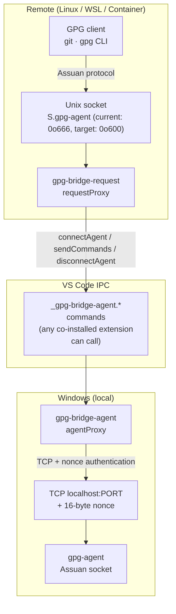

# Security Review Plan: gpg-bridge Extensions

**Date:** 2026-02-27
**Scope:** `gpg-bridge-agent` (Windows local), `gpg-bridge-request` (remote), `@gpg-bridge/shared`
**Status:** ⏳ In progress — four code changes completed during review (see Completed Changes)

---

## Architecture & Trust Model


```mermaid
flowchart TB
    subgraph Remote["Remote (Linux / WSL / Container)"]
        Client["GPG client<br>git · gpg CLI"]
        UDS["Unix socket<br/>S.gpg-agent (current: 0o666, target: 0o600)"]
        RP["gpg-bridge-request<br/>requestProxy"]
        Client -- "Assuan protocol" --> UDS
        UDS --> RP
    end

    subgraph Bridge["VS Code IPC"]
        CMD["_gpg-bridge-agent.*<br/>commands<br/>(any co-installed extension<br/>can call)"]
    end

    subgraph Windows["Windows (local)"]
        AP["gpg-bridge-agent<br/>agentProxy"]
        TCP["TCP localhost:PORT<br/>+ 16-byte nonce"]
        GPGAgent["gpg-agent<br/>Assuan socket"]
        AP -- "TCP + nonce authentication" --> TCP
        TCP --> GPGAgent
    end

    RP -- "connectAgent / sendCommands / disconnectAgent" --> CMD
    CMD --> AP
```

### Trust boundaries

| Boundary                                | Who can reach it                                                                                                 | Risk level                                            |
| --------------------------------------- | ---------------------------------------------------------------------------------------------------------------- | ----------------------------------------------------- |
| Unix socket `S.gpg-agent` (0o666→0o600) | Any local user on the remote system (mitigated by P3-3)                                                          | 🟡 Medium — extra-socket forbids private-key commands |
| VS Code command IPC                     | Any co-installed VS Code extension                                                                               | 🟡 Medium                                             |
| Windows TCP `localhost:PORT`            | Any process running as the same Windows user; nonce file is in a user-scoped folder accessible only to that user | 🟡 Medium — TOCTOU accepted (see P5-2)                |
| Subprocess env (`GNUPGHOME`)            | Controlled by extension config                                                                                   | 🟡 Medium                                             |
| GPG homedir socket file                 | Any process with write access to GNUPGHOME                                                                       | 🟢 Low (local trust)                                  |

---

## Completed Changes

The following code change was made to `agentProxy.ts` during the security review analysis
itself (not a pre-listed work item). Implementation of remaining work items should start
after verifying `npm test` still passes.

### `agentProxy.ts::stop()` — simplified and FATAL hang fixed _(2026-02-28)_

**Removed dead-code state guards.** The original loop had a DISCONNECTED/FATAL skip and an
ERROR/CLOSING conditional. Analysis confirmed both are unreachable: because
`handleCleanupRequested` is **synchronous**, the entire CLOSING→DISCONNECTED/FATAL chain
(including `sessions.delete()` in `onPermanentCleanup`) completes on the same call stack
before any external code can observe those states in the map.

**Fixed a hang.** The original `Promise.all` only resolved on `CLEANUP_COMPLETE`. A session
that reaches FATAL via `CLEANUP_ERROR` (unrecoverable `socket.destroy()` failure) would
never resolve, hanging `stop()` and therefore `deactivate()` indefinitely. Fixed by also
listening to `CLEANUP_ERROR`:

```typescript
const promise = new Promise<void>((resolve) => {
  session.once('CLEANUP_COMPLETE', resolve);
  session.once('CLEANUP_ERROR', resolve); // prevents hang if cleanup reaches FATAL
});
```

**Test needed** (`gpg-bridge-agent/src/test/agentProxy.test.ts`): ✅ **Done**
Test named `'resolves when session cleanup reaches FATAL via CLEANUP_ERROR (no hang)'`
added to the `stop()` describe block. Connects a session to READY, sets `destroyError`
on the socket, races `stop()` against a 500 ms timeout, asserts the promise resolves.

### `requestProxy.ts` — P2-1 client command-buffer size limit _(2026-02-28)_

Added `MAX_CLIENT_BUFFER_BYTES = 1 * 1024 * 1024` (1 MB) constant and overflow checks in
`RequestSessionManager`:

- **`handleClientDataStart`** — checked unconditionally (always transitions to `BUFFERING_COMMAND`).
- **`handleClientDataPartial`** — checked unconditionally for both `BUFFERING_COMMAND` and
  `BUFFERING_INQUIRE`. Initial implementation incorrectly exempted `BUFFERING_INQUIRE` on
  the assumption that D-blocks could be large (e.g. `PKDECRYPT` ciphertext). Investigation
  of the [Agent PKDECRYPT protocol](https://www.gnupg.org/documentation/manuals/gnupg/Agent-PKDECRYPT.html)
  confirmed this is wrong: D-blocks carry **asymmetric-encrypted session keys** (SPKI
  S-expressions), not bulk ciphertext. RSA-4096 ciphertext is ~512 bytes; with SPKI +
  hex encoding it is a few KB. No standard `gpg-agent` INQUIRE legitimately exceeds 1 MB.
  The limit applies uniformly.

**Tests** (`gpg-bridge-request/src/test/requestProxy.test.ts`): ✅ **Done**
Three tests in `describe('P2-1: Client buffer size limit')` — exactly 1 MB succeeds,
1 MB + 1 byte terminates the session, split chunks crossing the threshold also terminate.
Replaced unrealistic `'should handle very large D-block (multiple MB)'` (2 MB) with:

- `'should handle a large-but-realistic D-block (under 1 MB)'` (500 KB — passes)
- `'should terminate session when D-block exceeds 1 MB limit'` (1 MB + 1 byte — errors)

---

## Phase 1 — Information Disclosure & Logging

> Goal: ensure no sensitive data reaches logs in any configuration.

- [x] **P1-1** ✅ Fix forced debug logging in all three extensions
      There are **three** locations with the same `|| true` bug — fix all three:

  | File                                  | Line | Function               |
  | ------------------------------------- | ---- | ---------------------- |
  | `gpg-bridge-request/src/extension.ts` | ~97  | `startPublicKeySync()` |
  | `gpg-bridge-request/src/extension.ts` | ~126 | `startRequestProxy()`  |
  | `gpg-bridge-agent/src/extension.ts`   | ~201 | `startAgentProxy()`    |

  In each location replace:

  ```typescript
  // BUG: `|| true` forces debug logging ON regardless of user setting
  const debugLogging = config.get<boolean>('debugLogging') || true; // TODO remove forced debug logging
  ```

  With:

  ```typescript
  const debugLogging = config.get<boolean>('debugLogging') ?? false;
  ```

  **Severity:** 🟡 Medium — all protocol traffic (session IDs, Assuan command verbs) goes to the
  output channel when this is forced on.

- [x] **P1-2** ✅ Audit `sanitizeForLog` call discipline
      Audit complete: every `log()` call that uses socket data in `agentProxy.ts` and
      `requestProxy.ts` either (a) logs metadata only (byte counts, state names) or
      (b) wraps the payload in `sanitizeForLog()`. No gaps found. No code changes needed.

- [x] **P1-3** ✅ Ensure `D`-block data always goes through `sanitizeForLog`

  Audit complete: all D-block paths are already clean. No code changes needed.
  - `requestProxy.ts::handleClientDataStart` / `handleClientDataPartial` — log only
    byte counts (`data.length`, `this.buffer.length`); no raw content.
  - `requestProxy.ts::handleClientDataComplete` — logs `sanitizeForLog(data)`. ✅
  - `agentProxy.ts::handleAgentDataChunk` — intermediate log is byte count only;
    complete-response log uses `sanitizeForLog(this.buffer)`. ✅

- [x] **P1-4** ✅ Audit nonce bytes in log output
      The 16-byte nonce in the Gpg4win Assuan socket file (`S.gpg-agent`) is **not a per-session
      secret**:
  - The socket file lives in a folder only accessible to the same Windows user that runs
    gpg-agent (e.g. a user-scoped `GNUPGHOME` directory).
  - All gpg clients running as that same user read the same nonce from the same file.
  - The nonce is written once at gpg-agent startup and persists until gpg-agent restarts.

  Its purpose is a capability check — "prove you can read a file in `GNUPGHOME`" — not
  a per-session credential. Any same-user process that can authenticate to gpg-agent
  could have trivially obtained the nonce themselves by reading the socket file.

  **Marginal risk from logging:** The VS Code output channel is visible to any extension
  running in the same VS Code instance and potentially to remote telemetry. Logging the
  nonce bytes could expose the currently-active nonce to parties who have VS Code output-
  channel access but not same-user filesystem access to `GNUPGHOME` (a narrow scenario).

  **Work item:** Audit `agentProxy.ts::connectAgent`, `handleClientConnectRequested`, and
  `handleClientDataReceived` (`isNonce=true` branch). If the nonce buffer appears in any
  log call, replace it with a byte-count only (e.g. `16-byte nonce`). Add a code comment
  explaining the nonce's shared, same-user-readable nature.
  **Severity:** 🟢 Low — nonce is already accessible to all processes running as the same
  Windows user.

---

## Phase 2 — Input Validation & Protocol Parsing

> Goal: reject malformed or oversized input before it reaches state machines or subprocesses.

- [x] **P2-1** ✅ Add client-side buffer size limit in `RequestSessionManager`
      **File:** `gpg-bridge-request/src/services/requestProxy.ts`
      `this.buffer` in `RequestSessionManager` accumulates client data without bound.
      A stalled or malicious client on the remote can exhaust memory on the local Windows host.
      Add a constant `MAX_CLIENT_BUFFER_BYTES = 1 * 1024 * 1024` (1 MB, matching `spawnProcess`).
      In `handleClientDataPartial` (and `handleClientDataStart`), check `this.buffer.length` after
      appending; emit `ERROR_OCCURRED` if the limit is exceeded.
      Add a unit test: connect client, send 1 MB + 1 byte, assert session is closed with error.
      **Severity:** 🔴 High — unbounded memory growth.

- [x] **P2-2** ✅ Add port range validation in `parseSocketFile`
      **File:** `shared/src/protocol.ts`
      `parseInt(portStr, 10)` accepts 0, negative values, and integers > 65535.
      Add after the `isNaN` check:

  ```typescript
  if (port < 1 || port > 65535) {
    throw new Error(`Port out of range in socket file: ${port}`);
  }
  ```

  Add unit tests for ports 0, -1, 65535, 65536, and NaN.
  **Severity:** 🟢 Low — out-of-range port causes a connect failure, not a security bypass,
  but clean rejection is better than a cryptic OS error.

- [x] **P2-3** ✅ Validate `GNUPGHOME` before subprocess injection
      **File:** `shared/src/gpgCli.ts` (constructor / `env` getter)
      The `opts.gnupgHome` value is injected directly into the subprocess environment without
      validation. A path containing newlines or `=` characters could corrupt the environment block;
      a relative path could redirect gpg to attacker-controlled config.
      Add validation in the constructor:
  - Must be an absolute path (`path.isAbsolute()`).
  - Must not contain NUL bytes or newlines.
    Throw `Error` on violation.
    **Severity:** 🟡 Medium — realistically only reachable via VS Code workspace settings.

- [x] **P2-5** ✅ Add response buffer size limit in `AgentSessionManager`
      Added `MAX_RESPONSE_BUFFER_BYTES = 1 * 1024 * 1024` (1 MB) constant and overflow check in
      `handleAgentDataChunk`. Check fires after appending the chunk, before `detectResponseCompletion`.
      Replaced unrealistic `'should accumulate large response (>1MB)'` test with a realistic
      500 KB test; all three P2-5 tests pass (under-limit, single oversized chunk, split chunks).

- [x] **P2-4** ✅ Investigate `checkPipelinedData` empty-buffer edge case
      **File:** `gpg-bridge-request/src/services/requestProxy.ts`
      `checkPipelinedData()` emits `CLIENT_DATA_START` with `Buffer.from([])` (empty buffer)
      when `this.buffer` already contains data. `handleClientDataStart` appends
      `decodeProtocolData(data)` — decoding an empty buffer appends an empty string, which is
      harmless. Confirm this is safe and add a test for the pipelined-command scenario.
      **Severity:** 🟢 Low — likely correct but untested.

---

## Phase 3 — Access Control

> Goal: ensure only intended callers reach privileged operations.

- [x] **P3-1** ✅ Document VS Code command trust model
      **File:** `gpg-bridge-agent/src/extension.ts`
      The four `_gpg-bridge-agent.*` commands are in the global VS Code command registry and
      callable by any co-installed extension. This is an accepted architectural constraint.
      All four handlers already throw when `agentProxyService === null`:
  - `connectAgent` → `throw new Error('Agent proxy not initialized...')`
  - `sendCommands` → `throw new Error('Agent proxy not initialized...')`
  - `disconnectAgent` → `throw new Error('Agent proxy not initialized.')`
  - `exportPublicKeys` → `throw new Error('Agent proxy not started...')`

  **Work item (comments only):** Add a comment block above the four `registerCommand`
  calls in `activate()` explaining:
  - why an underscore prefix is used (VS Code convention for internal commands — hides
    them from the command palette but does not restrict callers), and
  - that any co-installed extension can invoke these commands (accepted trust model
    for the single-user dev-container scenario).

  **Severity:** 🟡 Medium — guard code is already correct; this is documentation only.

- [x] **P3-2** ✅ Document Assuan command passthrough security model
      **Files:** `gpg-bridge-agent/src/services/agentProxy.ts`, `docs/gpg-agent-protocol.md`

  The bridge connects to **`agent-extra-socket`** (not `agent-socket`). This is gpg-agent's
  built-in restricted socket — gpg-agent itself enforces command restrictions at the protocol
  level and returns `ERR 67109115 Forbidden` for disallowed commands:

  ```text
  > CLEAR_PASSPHRASE   → ERR 67109115 Forbidden
  > PRESET_PASSPHRASE  → ERR 67109115 Forbidden
  ```

  Of the commands previously flagged as high-risk, `PRESET_PASSPHRASE` and
  `CLEAR_PASSPHRASE` are blocked by gpg-agent. `GET_PASSPHRASE` is **permitted** on the
  extra socket — it invokes pinentry and returns the hex-encoded passphrase to the caller
  and often used with symmetric encryption; this is a confirmed secrets-in-transit path documented
  in P3-5. No bridge-side denylist or allowlist is needed or appropriate — gpg-agent is the
  correct trust anchor for command authorization.

  Remaining nuances to investigate and document:
  - `OPTION` is permitted on the extra socket but some arguments may be rejected. Enumerate
    which `OPTION` arguments are accepted vs. forbidden on the extra socket and add to
    `docs/gpg-agent-protocol.md`.
  - Verify whether any other verb accepted by the extra socket poses a risk in a shared
    multi-user container scenario (e.g. `GETINFO`, `KEYINFO`, `HAVEKEY`).

  **Work item:** Add a code comment in `agentProxy.ts` near `gpgAgentSocketPath` assignment
  (where `agent-extra-socket` is selected) explaining: (a) why the extra socket is used
  instead of the main socket, and (b) that gpg-agent enforces command restrictions itself.
  Update `docs/gpg-agent-protocol.md` with findings on OPTION argument restrictions.

  **Severity:** 🟢 Low — risk is already mitigated by gpg-agent's own enforcement;
  work item is documentation only.

- [x] **P3-3** ✅ Harden socket access via directory + socket permissions
      **File:** `gpg-bridge-request/src/services/requestProxy.ts`

  Two complementary layers of access control should be enforced:

  **Layer 1 — parent directory `0o700`.**
  On Linux, access to a Unix domain socket is gate-kept by the _directory_ that contains
  it — the `execute` bit on the directory controls whether a path component can be
  traversed at all. `0o700` (owner-only enter/search) prevents other local users from
  reaching the socket regardless of the socket file's own mode.

  Current gap: `0o700` is only applied on **creation** (`mkdirSync` with `mode: 0o700`
  inside `if (!existsSync)`). On a restart, when the directory already exists, its
  permissions are never checked or corrected, so a weaker mode from a prior run persists.

  Fix: add an `else` branch that always runs `chmodSync(socketDir, 0o700)`:

  ```typescript
  if (!this.fileSystem.existsSync(socketDir)) {
    this.fileSystem.mkdirSync(socketDir, { recursive: true, mode: 0o700 });
  } else {
    // Enforce 0o700 unconditionally so restarts cannot leave the directory at a
    // weaker mode from a prior run.
    this.fileSystem.chmodSync(socketDir, 0o700);
  }
  ```

  **Layer 2 — socket file `0o600`.**
  The current `chmodSync(agentSocketPath, 0o666)` is unnecessarily broad. GPG clients
  always run as the same user as the VS Code remote process — owner-only (`0o600`) is
  correct and matches the mode gpg-agent itself uses for its own sockets (`srwx------`).

  Fix: change the `listen()` callback chmod:

  ```typescript
  // 0o600: owner-only, matching gpg-agent's own socket mode (srwx------)
  // GPG clients run as the same user as this process, so world-write is never needed.
  // The parent directory is also 0o700 for defence-in-depth.
  this.fileSystem.chmodSync(agentSocketPath, 0o600);
  ```

  Also update the stale JSDoc `@step 3` comment from `0o666` to `0o600`.

  **Tests to update:** Two existing tests assert `0o666` and must be updated to `0o600`:
  - `gpg-bridge-request/src/test/requestProxy.test.ts` — test named
    `"should set socket permissions to 0o666"`: rename it and change the assertion.
  - `gpg-bridge-request/test/integration/requestProxyIntegration.test.ts` line ~106 —
    the integration test that calls `fs.statSync` and asserts `mode === 0o666`: change the
    expected value to `0o600` and update the error message string.

  **Severity:** 🟡 Medium — closes a permission-enforcement gap on restart; tightens overly
  broad socket permissions.

- [x] **P3-4** ✅ Add UUID format guard on `sessionId` input
      **Files:** `gpg-bridge-agent/src/services/agentProxy.ts` — `sendCommands`, `disconnectAgent`
      Both methods accept an arbitrary `sessionId: string` from the VS Code command caller.
      A non-UUID string misses the Map and is handled gracefully, but pollutes logs.
      Add a UUID format check at the top of each method:

  ```typescript
  const UUID_RE = /^[0-9a-f]{8}-[0-9a-f]{4}-4[0-9a-f]{3}-[89ab][0-9a-f]{3}-[0-9a-f]{12}$/i;
  if (!UUID_RE.test(sessionId)) {
    return Promise.reject(new Error(`Invalid sessionId format: ${sessionId}`));
  }
  ```

  **Severity:** 🟢 Low — defensive hardening.

- [x] **P3-5** ✅ Document accepted secrets-in-transit over the Assuan bridge (ESK + symmetric passphrase)

  During GPG operations, certain Assuan responses transit the full bridge path
  (extra-socket → agentProxy → VS Code IPC → requestProxy → client Unix socket)
  carrying secrets in cleartext. Two distinct scenarios exist:

  **Scenario A — Encrypted Session Key (ESK) in asymmetric decryption**

  When `gpg -d` decrypts a file encrypted to a public key (`--encrypt`):
  1. The gpg client sends the ESK (ciphertext of the symmetric file key, extracted
     from the file's public-key packet) to gpg-agent via `PKDECRYPT`.
  2. gpg-agent decrypts the ESK using the locally-held private key and returns the
     plaintext session key in a `D` S-expression block.
  3. The gpg client uses that session key to decrypt the bulk file data itself.

  The session key is _ephemeral_ — it is specific to one encrypted file and provides
  no leverage against other files, other keys, or the user's master passphrase.

  **Scenario B — Raw passphrase in symmetric decryption**

  `GET_PASSPHRASE` is permitted on the extra socket (confirmed by direct test:
  `GET_PASSPHRASE testcache1 errormsg theprompt thedescript` → `OK <hex-passphrase>`).
  A remote GPG client relayed through the bridge can invoke GET_PASSPHRASE directly.
  When `gpg -d` decrypts a file encrypted to a symmetric key (`--symmetric`):
  1. The gpg client sends `GET_PASSPHRASE <cache-id> <error> <prompt> <desc>` via the bridge.
  2. gpg-agent invokes pinentry on the local machine; the user types the passphrase.
  3. gpg-agent returns the raw passphrase hex-encoded in a `D` block over the bridge.
  4. The gpg client runs that passphrase through a Key Derivation Function (like S2K),
     and uses the resulting key to decrypt the file.

  The raw passphrase — not a derived key — travels over the bridge. If the user
  reuses that passphrase (e.g. it is also their master key passphrase or an account
  password), compromise of the bridge channel yields higher-value credentials.

  **Accepted risk — Unix trust model applies to both scenarios**

  Both secrets transit the same local IPC channels:
  - `agent-extra-socket` (Unix domain socket, 0o700 directory + 0o600 socket — P3-3)
  - VS Code command IPC (same-process extension host — P3-1)
  - `S.gpg-agent` request-proxy socket (Unix domain socket, 0o600 — P3-3)

  An attacker capable of intercepting any of these channels already has same-user
  access. At that privilege level, more direct attacks are available:
  - `ptrace` the gpg process to read decrypted output or heap memory
  - Read the decrypted file from disk or page cache after decryption completes
  - Install a keylogger to capture the passphrase at pinentry input
  - Read pinentry's own socket or pipe

  If the transport is compromised, the entire user session is already compromised.
  This is the standard Unix trust model under which all local Assuan IPC operates.

  **Consequence differential**

  | Scenario      | Secret type                      | Ephemeral?             | Consequence if intercepted                |
  | ------------- | -------------------------------- | ---------------------- | ----------------------------------------- |
  | A: asymmetric | Session key (symmetric file key) | ✅ Yes — one file only | Decrypts one specific file                |
  | B: symmetric  | Raw passphrase                   | ❌ No — may be reused  | May unlock other files, keys, or accounts |

  Scenario B carries a higher consequence profile than A even though exploitability
  is identical (requires same-user socket access in both cases).

  **Work item (documentation only):** No code change is possible — the passphrase and
  session key handling are inside gpg-agent and the gpg client; the bridge is a
  transparent relay and cannot intercept or filter `D`-block content without breaking
  the Assuan protocol. Add a reference comment in `agentProxy.ts` near the P3-2 block
  and update `docs/security-review-plan.md` with this entry.

  **Severity:** 🟡 Medium — accepted per Unix trust model. Scenario B (symmetric
  passphrase) carries higher consequence than Scenario A (ESK); no code change is
  possible or appropriate.

---

## Phase 4 — Resource Management & Denial of Service

> Goal: bound memory, connections, and session lifetime.

- [x] **P4-1** ✅ Implement concurrent session limit
      **Files:** `gpg-bridge-request/src/services/requestProxy.ts`,
      `gpg-bridge-agent/src/services/agentProxy.ts`
      Both session Maps grow without bound. A client that opens many connections and stalls
      before sending data causes unbounded Map growth and parallel TCP connections to gpg-agent.
      Add a `const MAX_SESSIONS = 32` hardcoded constant (not a user-facing setting) in both
      `RequestProxy`'s connection handler and `AgentProxy.connectAgent`.
  - In `RequestProxy`: check `this.sessions.size >= MAX_SESSIONS` before creating
    `RequestSessionManager`; destroy `clientSocket` immediately if limit reached.
  - In `AgentProxy.connectAgent`: check `this.sessions.size >= MAX_SESSIONS` before
    creating `AgentSessionManager`; throw `Error('Session limit reached')` if exceeded.

  **Severity:** 🟡 Medium — DoS risk in shared-container scenarios.

- [x] **P4-2** ✅ Add idle timeout in `RequestSessionManager`
      **File:** `gpg-bridge-request/src/services/requestProxy.ts`
      A client that opens the socket and sends nothing holds the session open indefinitely.
      The idle timeout must guard _client_ idle time — not the agent handshake phase.
      The agent handshake (connection + greeting) already has its own 5 s + 5 s timeouts in
      `agentProxy.ts`; starting the idle timer before the socket is resumed would race with
      those and produce spurious timeouts.
  - Add `const CLIENT_IDLE_TIMEOUT_MS = 30_000` near the top of the class.
  - Add a `private idleTimeout: NodeJS.Timeout | null = null` field.

  **Placement:** Start the timer **after** `this.socket.resume()` inside
  `handleClientSocketConnected` — specifically, in the success branch after the greeting
  has been forwarded to the client:

  ```typescript
  this.socket.resume();
  this.idleTimeout = setTimeout(() => {
    this.emit('ERROR_OCCURRED', `Client idle timeout after ${CLIENT_IDLE_TIMEOUT_MS}ms`);
  }, CLIENT_IDLE_TIMEOUT_MS);
  ```

  **Clear it** at the top of `handleClientDataStart` (first data arrived):

  ```typescript
  if (this.idleTimeout) {
    clearTimeout(this.idleTimeout);
    this.idleTimeout = null;
  }
  ```

  Also clear it in `handleCleanupRequested` to avoid the timer firing during teardown.

  **Severity:** 🟡 Medium.

- [x] **P4-3** ✅ Verify and document `RequestProxy.stop()` CLOSING safety
      **File:** `gpg-bridge-request/src/services/requestProxy.ts::stop()`

  **Analysis:** `stop()` iterates `this.sessions` and emits `CLEANUP_REQUESTED`
  unconditionally:

  ```typescript
  for (const session of this.sessions.values()) {
    session.emit('CLEANUP_REQUESTED', false);
  }
  ```

  **Why FATAL/DISCONNECTED are not the risk:** Sessions are deleted from `this.sessions`
  _before_ they reach FATAL or DISCONNECTED — the `.once('CLEANUP_COMPLETE')` /
  `.once('CLEANUP_ERROR')` listeners in the connection handler call
  `this.sessions.delete(sessionId)` synchronously, before the state transitions to
  DISCONNECTED or FATAL. Those states are therefore unreachable in the map.

  **Why CLOSING sessions are also safe:** `CLEANUP_REQUESTED` is registered with `.once()`:

  ```typescript
  this.once('CLEANUP_REQUESTED', this.handleCleanupRequested.bind(this));
  ```

  Node's `EventEmitter` removes a `.once` listener **synchronously at invocation time**,
  before the handler executes a single statement. So by the time a session is in CLOSING
  (mid-`await disconnectAgent()`), its `CLEANUP_REQUESTED` listener is already gone.
  When `stop()` emits `CLEANUP_REQUESTED` on that session, there is no listener; the emit
  is a silent no-op. `transition()` is never called a second time; no exception is thrown.
  The in-progress cleanup continues independently, closes the socket, and eventually
  unblocks `server.close()`.

  **Contrast with `agentProxy.ts::stop()`:** `agentProxy.ts` uses `ERROR_OCCURRED` (not
  `CLEANUP_REQUESTED`) to trigger cleanup in `stop()`. `ERROR_OCCURRED` is also registered
  with `.once()`, so the second emit is equally a no-op. The original `agentProxy.ts` had
  explicit DISCONNECTED/FATAL/ERROR/CLOSING state guards, but these were removed during
  the security review as unreachable dead code — the synchronous cleanup chain means only
  active states (CONNECTING_TO_AGENT through WAITING_FOR_AGENT) can appear in the map.
  See **Completed Changes** above.

  **Work item (comment only):** Add a comment in `requestProxy.ts::stop()` above the
  emit loop explaining:
  - FATAL/DISCONNECTED cannot appear in the map (deleted via `.once(CLEANUP_COMPLETE/ERROR)`
    before state transitions)
  - CLOSING sessions are safe because the `.once(CLEANUP_REQUESTED)` listener was already
    consumed; the second emit is a no-op and the in-progress cleanup will unblock
    `server.close()`
  - This explains the intentional difference from `agentProxy.ts::stop()`

  **Severity:** 🟢 Informational — no code change needed; comment only for future
  maintainability.

---

## Phase 5 — Nonce & Authentication Integrity

> Goal: document the nonce mechanism accurately and ensure no false assumptions exist in code comments.

- [x] **P5-1** ✅ Document nonce lifecycle and add clarifying comment
      **File:** `gpg-bridge-agent/src/services/agentProxy.ts`
      `pendingNonce` is cleared to `null` after the nonce is written to the socket — good
      hygiene, but note the nonce's actual threat model:
      the same nonce value is readable by any process running as the same Windows user from
      the Gpg4win socket file in `GNUPGHOME`, and it persists unchanged until gpg-agent
      restarts. It is a same-user capability token, not a per-session secret.

      **Work item (comment only):** Add a comment near `pendingNonce = null` explaining:
      (a) the nonce is cleared as a hygiene measure, not because it is a unique secret, and
      (b) the nonce is shared by all gpg clients running as the same Windows user and is
      accessible to any same-user process that can read `GNUPGHOME`.
      **Severity:** 🟢 Low — informational; clearing `pendingNonce` is already done correctly.

- [x] **P5-2** ✅ Document TOCTOU on socket file read-then-connect
      **File:** `gpg-bridge-agent/src/services/agentProxy.ts::connectAgent`
      Between `readFileSync(gpgAgentSocketPath)` and the TCP connect, a process running as
      the same Windows user with write access to `GNUPGHOME` could replace the socket file
      with a different port + nonce, redirecting the bridge to a different TCP listener.
      This is an inherent TOCTOU for any Assuan client (gpg CLI itself has the same race).
      The attack requires write access to `GNUPGHOME`, which already implies full gpg-agent
      control for that user — a same-user process at that privilege level has many more
      direct attack vectors.
      Add a code comment documenting the accepted race and its prerequisite.
      **Severity:** 🟢 Low — inherent Assuan client pattern; requires same-user write access
      to `GNUPGHOME`.

- [x] **P5-3** ✅ Confirm agent-side nonce validation (no bridge-side comparison needed)
      The nonce is sent to gpg-agent and validated there (`check_nonce()` in gpg-agent source).
      The bridge never compares nonces itself, so there is no timing-oracle risk.
      Add a comment in `handleAgentDataReceived` confirming: "GPG agent closes the socket
      immediately on bad nonce — it never sends an application-level error response."
      **Severity:** ℹ️ Informational.

---

## Phase 6 — Supply Chain & Dependencies

- [x] **P6-1** ✅ Run `npm audit --audit-level=high` and remediate
      From repository root. Document all high/critical findings and their resolution.

  **Findings:** Three high-severity vulnerabilities, all transitive dependencies of
  `@j178/prek` (a root devDependency — a pre-commit / git-hook runner). None affect
  production code; `@j178/prek` is never bundled into any VSIX.
  | CVE / Advisory | Package | Vuln | Fixed in |
  |---|---|---|---|
  | GHSA-43fc-jf86-j433 | `axios` ≤ 1.13.4 | DoS via `__proto__` key in `mergeConfig` | `axios@1.13.5` |
  | GHSA-3ppc-4f35-3m26, GHSA-7r86-cg39-jmmj, GHSA-23c5-xmqv-rm74 | `minimatch` 10.0.0–10.2.2 | Multiple ReDoS patterns | removed from dep tree |
  | GHSA-7h2j-956f-4vf2 | `@isaacs/brace-expansion` 5.0.0 | Uncontrolled resource consumption | removed from dep tree |

  **Resolution:** `@j178/prek@0.3.4` (within the existing `^0.3.3` range) updates
  `axios` to `^1.13.5` and drops `minimatch` / `@isaacs/brace-expansion` from its
  dependency tree. Updated via `npm update @j178/prek`. `npm audit --audit-level=high`
  now reports `found 0 vulnerabilities`. All 410 tests pass.

  **Severity:** 🟢 Low — dev tooling only; no production exposure.

- [x] **P6-2** ✅ Verify `uuid` uses CSPRNG
      `uuid@^9`+ uses `crypto.randomFillSync` (Node native, not Math.random).
      Confirm the installed version is ≥ 9.0.0 in all three `package.json` files.
      **Findings:** Both `gpg-bridge-agent/package.json` and `gpg-bridge-request/package.json`
      declare `"uuid": "^9.0.1"`. Installed version is `9.0.1` in both packages.
      `uuid@9.0.1` calls `crypto.randomFillSync` for all randomness — no `Math.random` path.
      `shared` and the root workspace do not use `uuid` directly.
      No code change needed.

  **Severity:** 🟢 Low — informational confirmation.

- [x] **P6-3** ✅ Review `which` package for PATH injection (Windows)
      `which.sync('gpgconf')` on Windows resolves against `PATH`. A malicious directory early in
      `PATH` could shadow `gpgconf.exe`. This is a general Windows security concern, not specific
      to this extension. Document that `gpgBinDir` (explicit path) is the preferred hardened
      configuration.

  **Findings:**
  - 15-line comment added to `shared/src/gpgCli.ts::detect()` immediately before the
    `which.sync` call. Explains the PATH injection risk, its OS-level scope, and that setting
    `gpgBridgeAgent.gpgBinDir` / `gpgBridgeRequest.gpgBinDir` to an absolute path bypasses
    the `which` probe entirely.
  - `gpgBridgeRequest.gpgBinDir` config property added to `gpg-bridge-request/package.json`
    (type `string`, scope `resource`, default empty) — mirrors the existing agent setting.
  - `gpg-bridge-request/src/extension.ts`: reads `gpgBinDir` from VS Code config and passes
    `gpgCliFactory: { create: () => new GpgCli({ gpgBinDir }) }` to `RequestProxy` deps,
    making the setting take effect at proxy start.
  - Both READMEs updated: agent README has Trust model + Hardened installation subsections;
    request README has Socket permissions, Transport, Trust model, and Custom/non-standard
    GPG location subsections. Configuration tables in both READMEs reflect the settings.

  **Severity:** 🟢 Low.

---

## Implementation Guidance

### Priority order for implementing agent

```
P1-1  (fix forced debug logging)              ✅ done — no tests needed (config read)
P1-3  (audit D-block log exposure)            ✅ done — all paths already use sanitizeForLog or metadata-only logging
P1-2  (audit sanitizeForLog discipline)       ✅ done — no gaps found across both service files
P2-1  (client buffer limit)                   ✅ done — tests added to requestProxy.test.ts
P2-5  (agent response buffer limit)           ✅ done — tests added to agentProxy.test.ts
P2-2  (port range validation)                 ✅ done — 5 tests added to protocol.test.ts
P3-1  (VS Code command trust comment)         ✅ done — comment added above registerCommand calls
P5-1  (nonce clearance audit)                 ✅ done — comment added near pendingNonce = null
P3-4  (UUID format guard)                     ✅ done — UUID_RE guard added to sendCommands + disconnectAgent
P2-3  (GNUPGHOME validation)                  ✅ done — constructor guard + 4 tests in gpgCli.test.ts
P3-3  (dir + socket permissions)              ✅ done — else-branch chmodSync(dir, 0o700) + socket 0o666→0o600 + 2 tests updated/added
P4-2  (idle timeout)                          ✅ done — CLIENT_IDLE_TIMEOUT_MS=30s, injectable via deps, timer in handleClientSocketConnected, cleared in handleClientDataStart + handleCleanupRequested, 2 tests
P4-3  (stop() CLOSING safety verification)    ✅ done — comment added in stop() explaining FATAL/DISCONNECTED unreachability and CLOSING .once() no-op safety
P2-4  (pipelined data edge case)              ✅ done — 2 tests in describe('P2-4'): back-to-back chunk verifies 2 sendCommands calls; empty-buffer test verifies args[1] contains full second command
P1-4  (audit nonce log exposure)              ✅ done — audit only; all 3 paths already clean: connectAgent logs port only, handleAgentSocketConnected logs text only, handleClientDataReceived already uses `${length}-byte nonce`
P5-2 / P5-3                                   ✅ done — P5-2: TOCTOU accepted-race comment in connectAgent near readFileSync; P5-3: expanded nonce validation comment in handleAgentDataReceived
P3-2  (extra-socket model + OPTION args)      ✅ done — 13-line comment in agentProxy.ts::start() near extra-socket assignment; new §9 in gpg-agent-protocol.md covering socket comparison, forbidden commands, OPTION argument table, pinentry-mode and putenv notes, bridge-side policy rationale
P4-1  (concurrent session limit)              ✅ done — MAX_SESSIONS=32 constant + guard in requestProxy connection callback (destroy socket) + guard in agentProxy.connectAgent() (throw 'Session limit reached'); 3 tests added (2 requestProxy, 1 agentProxy)
P6-2  (uuid CSPRNG verification)              ✅ done — both packages pin uuid@^9.0.1, installed 9.0.1; uses crypto.randomFillSync; no Math.random path; no code change needed
P6-3  (which PATH injection doc)              ✅ done — comment in gpgCli.ts::detect(); gpgBridgeRequest.gpgBinDir config + code added to request extension; Security sections added to both READMEs
P6-1  (npm audit)                             ✅ done — 3 high findings in @j178/prek transitive deps (axios, minimatch, brace-expansion); resolved by npm update @j178/prek@0.3.4; 0 vulnerabilities
Completed Changes (stop() FATAL fix)          ✅ done — test added to agentProxy.test.ts
P3-5  (ESK + symmetric passphrase data-in-transit)  ✅ done — comment in agentProxy.ts + §P3-5 in security-review-plan.md
```

**Security review complete.** All 23 items resolved.

### File → phase mapping

| File                                                                  | Phases                                                                   |
| --------------------------------------------------------------------- | ------------------------------------------------------------------------ |
| `gpg-bridge-request/src/extension.ts`                                 | P1-1 (two occurrences: `startPublicKeySync`, `startRequestProxy`)        |
| `gpg-bridge-agent/src/extension.ts`                                   | P1-1 (one occurrence: `startAgentProxy`), P3-1                           |
| `gpg-bridge-request/src/services/requestProxy.ts`                     | P1-2, P1-3, P2-1, P2-4, P3-3, P4-1, P4-2, P4-3                           |
| `gpg-bridge-request/src/test/requestProxy.test.ts`                    | P3-3 (update `0o666` → `0o600` assertions)                               |
| `gpg-bridge-request/test/integration/requestProxyIntegration.test.ts` | P3-3 (update `0o666` → `0o600` assertion)                                |
| `gpg-bridge-agent/src/services/agentProxy.ts`                         | P1-4, P2-5, P3-2 (comment), P3-4, P3-5 (comment), P4-1, P5-1, P5-2, P5-3 |
| `gpg-bridge-agent/src/test/agentProxy.test.ts`                        | Completed Changes (add stop() CLEANUP_ERROR test)                        |
| `docs/gpg-agent-protocol.md`                                          | P3-2 (OPTION argument findings)                                          |
| `shared/src/protocol.ts`                                              | P2-2                                                                     |
| `shared/src/gpgCli.ts`                                                | P2-3                                                                     |
| `shared/src/test/protocol.test.ts`                                    | P2-2 (tests)                                                             |

### Testing requirements per phase

| Work item                        | Test requirement                                                                                                                                                                                 |
| -------------------------------- | ------------------------------------------------------------------------------------------------------------------------------------------------------------------------------------------------ |
| P1-1 (forced debug logging)      | ✅ Done — no automated test needed; change is a one-line config read fix. All 386 existing tests continue to pass.                                                                               |
| P1-2 (sanitizeForLog audit)      | ✅ Done — audit only; no code changes needed; no new tests required.                                                                                                                             |
| P1-3 (D-block log exposure)      | ✅ Done — audit only; all paths already clean; no code changes needed; no new tests required.                                                                                                    |
| P2-1 (buffer limit)              | ✅ Done — 3 tests in `describe('P2-1: Client buffer size limit')`; replaced unrealistic 2 MB D-block test with 500 KB pass case and 1 MB+1 byte error case                                       |
| P2-2 (port range)                | ✅ Done — 5 tests: ports 0, -1 throw; port 65535 accepted; port 65536 throws; NaN already covered by pre-existing test                                                                           |
| P2-3 (GNUPGHOME)                 | ✅ Done — 4 tests: relative path throws, NUL byte throws, newline throws, valid absolute path accepted                                                                                           |
| P3-4 (UUID guard)                | ✅ Done — 3 tests: non-UUID sendCommands throws; non-UUID disconnectAgent throws; valid-UUID unknown session handled correctly (no throw)                                                        |
| P4-2 (idle timeout)              | ✅ Done — 2 tests with `clientIdleTimeoutMs: 50/100` injection: idle with no data triggers cleanup + idle-timeout log; sending data before timeout cancels timer and logs no timeout             |
| P2-4 (pipelined data)            | ✅ Done — 2 tests: (1) single chunk with CMD1\\nCMD2\\n asserts 2 sendCommands calls + ≥2 OK responses written; (2) buffer-corruption test verifies second command args[1] contains full payload |
| P2-5 (agent buffer limit)        | ✅ Done — 3 tests in `describe('P2-5: Agent response buffer size limit')`; replaced unrealistic `>1MB` response test with 500 KB pass case                                                       |
| P3-1 (command trust comments)    | ✅ Done — comment block added above `registerCommand` calls in `gpg-bridge-agent/src/extension.ts`; no automated test                                                                            |
| P3-3 (dir + socket permissions)  | ✅ Done — `existsSync`=`true` test: renamed + strengthened to assert 0o700 on dir + 0o600 on socket, no mkdirSync; `existsSync`=`false` test: retains mkdirSync + 0o600 socket assertion         |
| P4-1 (session limit)             | Integration: open `MAX_SESSIONS + 1` connections simultaneously, assert the last connection is rejected/destroyed immediately                                                                    |
| P4-3 (stop() CLOSING comment)    | ✅ Done — comment expanded above emit loop; explains FATAL/DISCONNECTED unreachable via .once(CLEANUP_COMPLETE/ERROR) deletion, CLOSING .once() no-op, and contrast with agentProxy.ts::stop()   |
| P5-1 (nonce clearance)           | ✅ Done — comment added in `handleAgentSocketConnected` explaining nonce is a same-user capability token, not a per-session secret; no automated test needed                                     |
| P6-1 (npm audit)                 | Run `npm audit --audit-level=high`; record findings and resolutions in `docs/security-review-plan.md` under a new **Phase 6 Findings** section                                                   |
| Completed Changes (stop() FATAL) | ✅ Done — `'resolves when session cleanup reaches FATAL via CLEANUP_ERROR (no hang)'` in `agentProxy.test.ts` stop() describe block                                                              |

Run `npm test` after each phase. All existing tests must continue to pass.
