# Security Review Plan: gpg-bridge Extensions

**Date:** 2026-02-27
**Scope:** `gpg-bridge-agent` (Windows local), `gpg-bridge-request` (remote), `@gpg-bridge/shared`
**Status:** ⏳ In progress — no code changes made yet

---

## Architecture & Trust Model

```mermaid
flowchart TB
    subgraph Remote["Remote (Linux / WSL / Container)"]
        Client["GPG client<br>git · gpg CLI"]
        UDS["Unix socket<br/>S.gpg-agent  0o666"]
        RP["gpg-bridge-request<br/>requestProxy"]
        Client -- "Assuan protocol" --> UDS
        UDS --> RP
    end

    subgraph Bridge["VS Code IPC"]
        CMD["_gpg-bridge-agent.*<br/>commands<br/>(any co-installed extension<br/>can call)"]
    end

    subgraph Windows["Windows (local)"]
        AP["gpg-bridge-agent<br/>agentProxy"]
        TCP["TCP localhost:PORT<br/>+ 16-byte nonce"]
        GPGAgent["gpg-agent<br/>Assuan socket"]
        AP -- "TCP + nonce authentication" --> TCP
        TCP --> GPGAgent
    end

    RP -- "connectAgent / sendCommands / disconnectAgent" --> CMD
    CMD --> AP
```



### Trust boundaries

| Boundary                          | Who can reach it                                   | Risk level                   |
| --------------------------------- | -------------------------------------------------- | ---------------------------- |
| Unix socket `S.gpg-agent` (0o666) | Any local user on the remote system                | 🔴 High in shared containers |
| VS Code command IPC               | Any co-installed VS Code extension                 | 🟡 Medium                    |
| Windows TCP `localhost:PORT`      | Any local Windows process (pre-auth, nonce guards) | 🟡 Medium                    |
| Subprocess env (`GNUPGHOME`)      | Controlled by extension config                     | 🟡 Medium                    |
| GPG homedir socket file           | Any process with write access to GNUPGHOME         | 🟢 Low (local trust)         |

---

## Phase 1 — Information Disclosure & Logging

> Goal: ensure no sensitive data reaches logs in any configuration.

- [ ] **P1-1** Fix forced debug logging
      **File:** `gpg-bridge-request/src/extension.ts` (~line 93)

  ```typescript
  // BUG: `|| true` forces debug logging ON regardless of user setting
  const debugLogging = config.get<boolean>('debugLogging') || true; // TODO remove forced debug logging
  ```

  Change to:

  ```typescript
  const debugLogging = config.get<boolean>('debugLogging') ?? false;
  ```

  **Severity:** 🟡 Medium — all protocol traffic (session IDs, Assuan command verbs) goes to the
  output channel when this is forced on.

- [ ] **P1-2** Audit `sanitizeForLog` call discipline
      Every `log()` call that writes socket data must go through `sanitizeForLog()`.
      Search `agentProxy.ts` and `requestProxy.ts` for `log(` calls where the final argument
      is a raw buffer or decoded string rather than `sanitizeForLog(...)`.
      Fix any gaps found.
      **Severity:** 🟢 Low — `sanitizeForLog` is well-designed; this is a call-site audit.

- [ ] **P1-3** Verify `D`-block data never reaches logs
      The INQUIRE / D-block path carries the plaintext or ciphertext payload of GPG operations
      (e.g., `PKDECRYPT`, `PKSIGN`). Confirm that neither `requestProxy.ts` nor `agentProxy.ts`
      logs the content of `D` lines, only their byte counts.
      **Files:** `requestProxy.ts` `handleClientDataPartial`, `agentProxy.ts` `handleAgentDataChunk`.
      **Severity:** 🔴 High — `D`-block data can contain private key material ciphertext.

- [ ] **P1-4** Confirm nonce bytes are never logged
      Between `parseSocketFile()` returning `{ nonce }` and `pendingNonce = null`, no log call
      must include the raw nonce buffer.
      Audit `agentProxy.ts::connectAgent` and `handleClientConnectRequested`.
      **Severity:** 🔴 High — logging the nonce would enable replay authentication.

---

## Phase 2 — Input Validation & Protocol Parsing

> Goal: reject malformed or oversized input before it reaches state machines or subprocesses.

- [ ] **P2-1** Add client-side buffer size limit in `RequestSessionManager`
      **File:** `gpg-bridge-request/src/services/requestProxy.ts`
      `this.buffer` in `RequestSessionManager` accumulates client data without bound.
      A stalled or malicious client on the remote can exhaust memory on the local Windows host.
      Add a constant `MAX_CLIENT_BUFFER_BYTES = 1 * 1024 * 1024` (1 MB, matching `spawnProcess`).
      In `handleClientDataPartial` (and `handleClientDataStart`), check `this.buffer.length` after
      appending; emit `ERROR_OCCURRED` if the limit is exceeded.
      Add a unit test: connect client, send 1 MB + 1 byte, assert session is closed with error.
      **Severity:** 🔴 High — unbounded memory growth.

- [ ] **P2-2** Add port range validation in `parseSocketFile`
      **File:** `shared/src/protocol.ts`
      `parseInt(portStr, 10)` accepts 0, negative values, and integers > 65535.
      Add after the `isNaN` check:

  ```typescript
  if (port < 1 || port > 65535) {
    throw new Error(`Port out of range in socket file: ${port}`);
  }
  ```

  Add unit tests for ports 0, -1, 65535, 65536, and NaN.
  **Severity:** 🟢 Low — out-of-range port causes a connect failure, not a security bypass,
  but clean rejection is better than a cryptic OS error.

- [ ] **P2-3** Validate `GNUPGHOME` before subprocess injection
      **File:** `shared/src/gpgCli.ts` (constructor / `env` getter)
      The `opts.gnupgHome` value is injected directly into the subprocess environment without
      validation. A path containing newlines or `=` characters could corrupt the environment block;
      a relative path could redirect gpg to attacker-controlled config.
      Add validation in the constructor:
  - Must be an absolute path (`path.isAbsolute()`).
  - Must not contain NUL bytes or newlines.
    Throw `Error` on violation.
    **Severity:** 🟡 Medium — realistically only reachable via VS Code workspace settings.

- [ ] **P2-4** Investigate `checkPipelinedData` empty-buffer edge case
      **File:** `gpg-bridge-request/src/services/requestProxy.ts`
      `checkPipelinedData()` emits `CLIENT_DATA_START` with `Buffer.from([])` (empty buffer)
      when `this.buffer` already contains data. `handleClientDataStart` appends
      `decodeProtocolData(data)` — decoding an empty buffer appends an empty string, which is
      harmless. Confirm this is safe and add a test for the pipelined-command scenario.
      **Severity:** 🟢 Low — likely correct but untested.

---

## Phase 3 — Access Control

> Goal: ensure only intended callers reach privileged operations.

- [ ] **P3-1** Document VS Code command trust model and add guard consistency check
      **File:** `gpg-bridge-agent/src/extension.ts`
      The four `_gpg-bridge-agent.*` commands are in the global VS Code command registry and
      callable by any co-installed extension. This is an accepted architectural constraint.
      Actions:
  1. Add a code comment on each `registerCommand` call explaining the accepted trust model.
  2. Verify all four command handlers (`connectAgent`, `sendCommands`, `disconnectAgent`,
     `exportPublicKeys`) reject calls when `agentProxyService === null` by throwing
     (not returning undefined). Currently `exportPublicKeys` does this; audit the others.
     **Severity:** 🟡 Medium — documentation reduces future confusion; guard consistency matters.

- [ ] **P3-2** Document Assuan command passthrough security model
      **Files:** `gpg-bridge-agent/src/services/agentProxy.ts`, `docs/gpg-agent-protocol.md`

  The bridge connects to **`agent-extra-socket`** (not `agent-socket`). This is gpg-agent's
  built-in restricted socket — gpg-agent itself enforces command restrictions at the protocol
  level and returns `ERR 67109115 Forbidden` for disallowed commands:

  ```
  > CLEAR_PASSPHRASE   → ERR 67109115 Forbidden
  > PRESET_PASSPHRASE  → ERR 67109115 Forbidden
  ```

  The commands previously flagged as high-risk (`PRESET_PASSPHRASE`, `CLEAR_PASSPHRASE`,
  `GET_PASSPHRASE`) are therefore already blocked by gpg-agent before they could have any
  effect. No bridge-side denylist or allowlist is needed or appropriate — gpg-agent is the
  correct trust anchor for command authorization.

  Remaining nuances to investigate and document:
  - `OPTION` is permitted on the extra socket but some arguments may be rejected. Enumerate
    which `OPTION` arguments are accepted vs. forbidden on the extra socket and add to
    `docs/gpg-agent-protocol.md`.
  - Verify whether any other verb accepted by the extra socket poses a risk in a shared
    multi-user container scenario (e.g. `GETINFO`, `KEYINFO`, `HAVEKEY`).

  **Work item:** Add a code comment in `agentProxy.ts` near `gpgAgentSocketPath` assignment
  (where `agent-extra-socket` is selected) explaining: (a) why the extra socket is used
  instead of the main socket, and (b) that gpg-agent enforces command restrictions itself.
  Update `docs/gpg-agent-protocol.md` with findings on OPTION argument restrictions.

  **Severity:** 🟢 Low — risk is already mitigated by gpg-agent's own enforcement;
  work item is documentation only.

- [ ] **P3-3** Harden socket access via directory + socket permissions
      **File:** `gpg-bridge-request/src/services/requestProxy.ts`

  Two complementary layers of access control should be enforced:

  **Layer 1 — parent directory `0o700`.**
  On Linux, access to a Unix domain socket is gate-kept by the _directory_ that contains
  it — the `execute` bit on the directory controls whether a path component can be
  traversed at all. `0o700` (owner-only enter/search) prevents other local users from
  reaching the socket regardless of the socket file's own mode.

  Current gap: `0o700` is only applied on **creation** (`mkdirSync` with `mode: 0o700`
  inside `if (!existsSync)`). On a restart, when the directory already exists, its
  permissions are never checked or corrected, so a weaker mode from a prior run persists.

  Fix: add an `else` branch that always runs `chmodSync(socketDir, 0o700)`:

  ```typescript
  if (!this.fileSystem.existsSync(socketDir)) {
    this.fileSystem.mkdirSync(socketDir, { recursive: true, mode: 0o700 });
  } else {
    // Enforce 0o700 unconditionally so restarts cannot leave the directory at a
    // weaker mode from a prior run.
    this.fileSystem.chmodSync(socketDir, 0o700);
  }
  ```

  **Layer 2 — socket file `0o600`.**
  The current `chmodSync(agentSocketPath, 0o666)` is unnecessarily broad. GPG clients
  always run as the same user as the VS Code remote process — owner-only (`0o600`) is
  correct and matches the mode gpg-agent itself uses for its own sockets (`srwx------`).

  Fix: change the `listen()` callback chmod:

  ```typescript
  // 0o600: owner-only, matching gpg-agent's own socket mode (srwx------)
  // GPG clients run as the same user as this process, so world-write is never needed.
  // The parent directory is also 0o700 for defence-in-depth.
  this.fileSystem.chmodSync(agentSocketPath, 0o600);
  ```

  Also update the stale JSDoc `@step 3` comment from `0o666` to `0o600`.

  **Severity:** 🟡 Medium — closes a permission-enforcement gap on restart; tightens overly
  broad socket permissions.

- [ ] **P3-4** Add UUID format guard on `sessionId` input
      **Files:** `gpg-bridge-agent/src/services/agentProxy.ts` — `sendCommands`, `disconnectAgent`
      Both methods accept an arbitrary `sessionId: string` from the VS Code command caller.
      A non-UUID string misses the Map and is handled gracefully, but pollutes logs.
      Add a UUID format check at the top of each method:
  ```typescript
  const UUID_RE = /^[0-9a-f]{8}-[0-9a-f]{4}-4[0-9a-f]{3}-[89ab][0-9a-f]{3}-[0-9a-f]{12}$/i;
  if (!UUID_RE.test(sessionId)) {
    return Promise.reject(new Error(`Invalid sessionId format: ${sessionId}`));
  }
  ```
  **Severity:** 🟢 Low — defensive hardening.

---

## Phase 4 — Resource Management & Denial of Service

> Goal: bound memory, connections, and session lifetime.

- [ ] **P4-1** Implement concurrent session limit
      **Files:** `gpg-bridge-request/src/services/requestProxy.ts`,
      `gpg-bridge-agent/src/services/agentProxy.ts`
      Both session Maps grow without bound. A client that opens many connections and stalls
      before sending data causes unbounded Map growth and parallel TCP connections to gpg-agent.
      Add a `MAX_SESSIONS = 32` (configurable) check in `RequestProxy`'s connection handler
      and in `AgentProxy.connectAgent`. Reject/destroy immediately if limit reached.
      **Severity:** 🟡 Medium — DoS risk in shared-container scenarios.

- [ ] **P4-2** Add idle timeout in `RequestSessionManager`
      **File:** `gpg-bridge-request/src/services/requestProxy.ts`
      `agentProxy.ts` has a 5 s connection timeout and 5 s greeting timeout.
      `RequestSessionManager` has no timeout between `CLIENT_SOCKET_CONNECTED` and the first
      client byte — a client that opens the socket and sends nothing holds the session open
      indefinitely.
      Add a `CLIENT_IDLE_TIMEOUT_MS = 30_000` constant and a `setTimeout` in
      `handleClientSocketConnected` that emits `ERROR_OCCURRED` if no data arrives within 30 s.
      Clear it in `handleClientDataStart`.
      **Severity:** 🟡 Medium.

- [ ] **P4-3** Verify FATAL sessions are excluded from `RequestProxy.stop()`
      **File:** `gpg-bridge-request/src/services/requestProxy.ts::stop()`
      `agentProxy.ts::stop()` explicitly skips sessions in `DISCONNECTED` and `FATAL` states.
      Verify `requestProxy.ts::stop()` has equivalent protection (emitting `CLEANUP_REQUESTED`
      on a FATAL session would be an invalid transition). Add the state check if absent.
      **Severity:** 🟢 Low.

---

## Phase 5 — Nonce & Authentication Integrity

> Goal: ensure the 16-byte nonce authentication cannot be weakened.

- [ ] **P5-1** Verify nonce clearance from memory
      **File:** `gpg-bridge-agent/src/services/agentProxy.ts`
      `pendingNonce` is set to `null` after the nonce is sent to the socket — good.
      Verify no other reference holds the nonce `Buffer` after that point (no closure captures,
      no log calls). Add a code comment explaining why the nonce is single-use and cleared.
      **Severity:** 🟡 Medium — nonce is a session authentication credential.

- [ ] **P5-2** Document TOCTOU on socket file read-then-connect
      **File:** `gpg-bridge-agent/src/services/agentProxy.ts::connectAgent`
      Between `readFileSync(gpgAgentSocketPath)` and the TCP connect, a sufficiently privileged
      process could replace the socket file with different port+nonce values.
      This is an inherent TOCTOU for any Assuan client and is acceptable for local loopback.
      Add a code comment documenting the accepted race and its prerequisite (write access to
      `GNUPGHOME`).
      **Severity:** 🟢 Low — accepted architectural risk.

- [ ] **P5-3** Confirm agent-side nonce validation (no bridge-side comparison needed)
      The nonce is sent to gpg-agent and validated there (`check_nonce()` in gpg-agent source).
      The bridge never compares nonces itself, so there is no timing-oracle risk.
      Add a comment in `handleAgentDataReceived` confirming: "GPG agent closes the socket
      immediately on bad nonce — it never sends an application-level error response."
      **Severity:** ℹ️ Informational.

---

## Phase 6 — Supply Chain & Dependencies

- [ ] **P6-1** Run `npm audit --audit-level=high` and remediate
      From repository root. Document all high/critical findings and their resolution.
      **Severity:** Variable.

- [ ] **P6-2** Verify `uuid` uses CSPRNG
      `uuid@^9`+ uses `crypto.randomFillSync` (Node native, not Math.random).
      Confirm the installed version is ≥ 9.0.0 in all three `package.json` files.
      **Severity:** 🟢 Low — informational confirmation.

- [ ] **P6-3** Review `which` package for PATH injection (Windows)
      `which.sync('gpgconf')` on Windows resolves against `PATH`. A malicious directory early in
      `PATH` could shadow `gpgconf.exe`. This is a general Windows security concern, not specific
      to this extension. Document that `gpgBinDir` (explicit path) is the preferred hardened
      configuration.
      **Severity:** 🟢 Low.

---

## Implementation Guidance

### Priority order for implementing agent

```
P1-1  (fix forced debug logging)         ← 5-minute fix, high surface reduction
P1-4  (audit nonce log exposure)         ← read-only audit
P1-3  (audit D-block log exposure)       ← read-only audit
P2-1  (client buffer limit)              ← memory safety, add tests
P2-2  (port range validation)            ← one-liner + tests
P3-1  (command guard consistency)        ← audit + comments
P5-1  (nonce clearance audit)            ← read-only + comment
P3-4  (UUID format guard)                ← defensive one-liner
P2-3  (GNUPGHOME validation)             ← constructor guard
P4-2  (idle timeout)                     ← new timer logic + tests
P4-3  (FATAL session in stop())          ← audit + conditional add
P5-2 / P5-3                              ← comments only
P3-2  (extra-socket model + OPTION args) ← comment in agentProxy + doc update
P6-1 / P6-2 / P6-3                       ← audit + documentation
```

No items currently require a human product decision before implementation.

### File → phase mapping

| File                                              | Phases                                                   |
| ------------------------------------------------- | -------------------------------------------------------- |
| `gpg-bridge-request/src/extension.ts`             | P1-1                                                     |
| `gpg-bridge-request/src/services/requestProxy.ts` | P1-2, P1-3, P2-1, P2-4, P3-3, P4-1, P4-2, P4-3           |
| `gpg-bridge-agent/src/extension.ts`               | P3-1                                                     |
| `gpg-bridge-agent/src/services/agentProxy.ts`     | P1-4, P3-1, P3-2 (comment), P3-4, P4-1, P5-1, P5-2, P5-3 |
| `docs/gpg-agent-protocol.md`                      | P3-2 (OPTION argument findings)                          |
| `shared/src/protocol.ts`                          | P2-2                                                     |
| `shared/src/gpgCli.ts`                            | P2-3                                                     |
| `shared/src/test/protocol.test.ts`                | P2-2 (tests)                                             |

### Testing requirements per phase

| Work item                       | Test requirement                                                                                                                                                           |
| ------------------------------- | -------------------------------------------------------------------------------------------------------------------------------------------------------------------------- |
| P2-1 (buffer limit)             | Unit: send exactly `MAX_BUFFER_BYTES`, assert OK; send `MAX+1`, assert session closed with error                                                                           |
| P2-2 (port range)               | Unit: ports 0, -1, 65535, 65536, NaN — all should throw                                                                                                                    |
| P2-3 (GNUPGHOME)                | Unit: relative path, path with NUL, path with newline — all should throw in constructor                                                                                    |
| P3-4 (UUID guard)               | Unit: empty string, `"not-a-uuid"`, valid UUID — only last should proceed                                                                                                  |
| P4-2 (idle timeout)             | Integration: open socket, send nothing for 31 s, assert session cleaned up                                                                                                 |
| P3-3 (dir + socket permissions) | Unit: `existsSync`=`true` → `chmodSync(dir, 0o700)` then `chmodSync(socket, 0o600)`; `existsSync`=`false` → `mkdirSync` with `mode: 0o700` then `chmodSync(socket, 0o600)` |
| P4-1 (session limit)            | Integration: open `MAX+1` connections, assert last is rejected                                                                                                             |

Run `npm test` after each phase. All existing tests must continue to pass.
