# Security Review Plan: gpg-bridge Extensions

**Date:** 2026-02-27
**Scope:** `gpg-bridge-agent` (Windows local), `gpg-bridge-request` (remote), `@gpg-bridge/shared`
**Status:** ⏳ In progress — four code changes completed during review (see Completed Changes)

---

## Architecture & Trust Model

```mermaid
flowchart TB
    subgraph Remote["Remote (Linux / WSL / Container)"]
        Client["GPG client<br>git · gpg CLI"]
        UDS["Unix socket<br/>S.gpg-agent (current: 0o666, target: 0o600)"]
        RP["gpg-bridge-request<br/>requestProxy"]
        Client -- "Assuan protocol" --> UDS
        UDS --> RP
    end

    subgraph Bridge["VS Code IPC"]
        CMD["_gpg-bridge-agent.*<br/>commands<br/>(any co-installed extension<br/>can call)"]
    end

    subgraph Windows["Windows (local)"]
        AP["gpg-bridge-agent<br/>agentProxy"]
        TCP["TCP localhost:PORT<br/>+ 16-byte nonce"]
        GPGAgent["gpg-agent<br/>Assuan socket"]
        AP -- "TCP + nonce authentication" --> TCP
        TCP --> GPGAgent
    end

    RP -- "connectAgent / sendCommands / disconnectAgent" --> CMD
    CMD --> AP
```



### Trust boundaries

| Boundary                                | Who can reach it                                                                                                 | Risk level                                            |
| --------------------------------------- | ---------------------------------------------------------------------------------------------------------------- | ----------------------------------------------------- |
| Unix socket `S.gpg-agent` (0o666→0o600) | Any local user on the remote system (mitigated by P3-3)                                                          | 🟡 Medium — extra-socket forbids private-key commands |
| VS Code command IPC                     | Any co-installed VS Code extension                                                                               | 🟡 Medium                                             |
| Windows TCP `localhost:PORT`            | Any process running as the same Windows user; nonce file is in a user-scoped folder accessible only to that user | 🟡 Medium — TOCTOU accepted (see P5-2)                |
| Subprocess env (`GNUPGHOME`)            | Controlled by extension config                                                                                   | 🟡 Medium                                             |
| GPG homedir socket file                 | Any process with write access to GNUPGHOME                                                                       | 🟢 Low (local trust)                                  |

---

## Completed Changes

The following code change was made to `agentProxy.ts` during the security review analysis
itself (not a pre-listed work item). Implementation of remaining work items should start
after verifying `npm test` still passes.

### `agentProxy.ts::stop()` — simplified and FATAL hang fixed _(2026-02-28)_

**Removed dead-code state guards.** The original loop had a DISCONNECTED/FATAL skip and an
ERROR/CLOSING conditional. Analysis confirmed both are unreachable: because
`handleCleanupRequested` is **synchronous**, the entire CLOSING→DISCONNECTED/FATAL chain
(including `sessions.delete()` in `onPermanentCleanup`) completes on the same call stack
before any external code can observe those states in the map.

**Fixed a hang.** The original `Promise.all` only resolved on `CLEANUP_COMPLETE`. A session
that reaches FATAL via `CLEANUP_ERROR` (unrecoverable `socket.destroy()` failure) would
never resolve, hanging `stop()` and therefore `deactivate()` indefinitely. Fixed by also
listening to `CLEANUP_ERROR`:

```typescript
const promise = new Promise<void>((resolve) => {
  session.once('CLEANUP_COMPLETE', resolve);
  session.once('CLEANUP_ERROR', resolve); // prevents hang if cleanup reaches FATAL
});
```

**Test needed** (`gpg-bridge-agent/src/test/agentProxy.test.ts`): ✅ **Done**
Test named `'resolves when session cleanup reaches FATAL via CLEANUP_ERROR (no hang)'`
added to the `stop()` describe block. Connects a session to READY, sets `destroyError`
on the socket, races `stop()` against a 500 ms timeout, asserts the promise resolves.

### `requestProxy.ts` — P2-1 client command-buffer size limit _(2026-02-28)_

Added `MAX_CLIENT_BUFFER_BYTES = 1 * 1024 * 1024` (1 MB) constant and overflow checks in
`RequestSessionManager`:

- **`handleClientDataStart`** — checked unconditionally (always transitions to `BUFFERING_COMMAND`).
- **`handleClientDataPartial`** — checked unconditionally for both `BUFFERING_COMMAND` and
  `BUFFERING_INQUIRE`. Initial implementation incorrectly exempted `BUFFERING_INQUIRE` on
  the assumption that D-blocks could be large (e.g. `PKDECRYPT` ciphertext). Investigation
  of the [Agent PKDECRYPT protocol](https://www.gnupg.org/documentation/manuals/gnupg/Agent-PKDECRYPT.html)
  confirmed this is wrong: D-blocks carry **asymmetric-encrypted session keys** (SPKI
  S-expressions), not bulk ciphertext. RSA-4096 ciphertext is ~512 bytes; with SPKI +
  hex encoding it is a few KB. No standard `gpg-agent` INQUIRE legitimately exceeds 1 MB.
  The limit applies uniformly.

**Tests** (`gpg-bridge-request/src/test/requestProxy.test.ts`): ✅ **Done**
Three tests in `describe('P2-1: Client buffer size limit')` — exactly 1 MB succeeds,
1 MB + 1 byte terminates the session, split chunks crossing the threshold also terminate.
Replaced unrealistic `'should handle very large D-block (multiple MB)'` (2 MB) with:

- `'should handle a large-but-realistic D-block (under 1 MB)'` (500 KB — passes)
- `'should terminate session when D-block exceeds 1 MB limit'` (1 MB + 1 byte — errors)

---

## Phase 1 — Information Disclosure & Logging

> Goal: ensure no sensitive data reaches logs in any configuration.

- [x] **P1-1** ✅ Fix forced debug logging in all three extensions
      There are **three** locations with the same `|| true` bug — fix all three:

  | File                                  | Line | Function               |
  | ------------------------------------- | ---- | ---------------------- |
  | `gpg-bridge-request/src/extension.ts` | ~97  | `startPublicKeySync()` |
  | `gpg-bridge-request/src/extension.ts` | ~126 | `startRequestProxy()`  |
  | `gpg-bridge-agent/src/extension.ts`   | ~201 | `startAgentProxy()`    |

  In each location replace:

  ```typescript
  // BUG: `|| true` forces debug logging ON regardless of user setting
  const debugLogging = config.get<boolean>('debugLogging') || true; // TODO remove forced debug logging
  ```

  With:

  ```typescript
  const debugLogging = config.get<boolean>('debugLogging') ?? false;
  ```

  **Severity:** 🟡 Medium — all protocol traffic (session IDs, Assuan command verbs) goes to the
  output channel when this is forced on.

- [x] **P1-2** ✅ Audit `sanitizeForLog` call discipline
      Audit complete: every `log()` call that uses socket data in `agentProxy.ts` and
      `requestProxy.ts` either (a) logs metadata only (byte counts, state names) or
      (b) wraps the payload in `sanitizeForLog()`. No gaps found. No code changes needed.

- [x] **P1-3** ✅ Ensure `D`-block data always goes through `sanitizeForLog`

  Audit complete: all D-block paths are already clean. No code changes needed.
  - `requestProxy.ts::handleClientDataStart` / `handleClientDataPartial` — log only
    byte counts (`data.length`, `this.buffer.length`); no raw content.
  - `requestProxy.ts::handleClientDataComplete` — logs `sanitizeForLog(data)`. ✅
  - `agentProxy.ts::handleAgentDataChunk` — intermediate log is byte count only;
    complete-response log uses `sanitizeForLog(this.buffer)`. ✅

- [ ] **P1-4** Audit nonce bytes in log output
      The 16-byte nonce in the Gpg4win Assuan socket file (`S.gpg-agent`) is **not a per-session
      secret**:
  - The socket file lives in a folder only accessible to the same Windows user that runs
    gpg-agent (e.g. a user-scoped `GNUPGHOME` directory).
  - All gpg clients running as that same user read the same nonce from the same file.
  - The nonce is written once at gpg-agent startup and persists until gpg-agent restarts.

  Its purpose is a capability check — "prove you can read a file in `GNUPGHOME`" — not
  a per-session credential. Any same-user process that can authenticate to gpg-agent
  could have trivially obtained the nonce themselves by reading the socket file.

  **Marginal risk from logging:** The VS Code output channel is visible to any extension
  running in the same VS Code instance and potentially to remote telemetry. Logging the
  nonce bytes could expose the currently-active nonce to parties who have VS Code output-
  channel access but not same-user filesystem access to `GNUPGHOME` (a narrow scenario).

  **Work item:** Audit `agentProxy.ts::connectAgent`, `handleClientConnectRequested`, and
  `handleClientDataReceived` (`isNonce=true` branch). If the nonce buffer appears in any
  log call, replace it with a byte-count only (e.g. `16-byte nonce`). Add a code comment
  explaining the nonce's shared, same-user-readable nature.
  **Severity:** 🟢 Low — nonce is already accessible to all processes running as the same
  Windows user.

---

## Phase 2 — Input Validation & Protocol Parsing

> Goal: reject malformed or oversized input before it reaches state machines or subprocesses.

- [x] **P2-1** ✅ Add client-side buffer size limit in `RequestSessionManager`
      **File:** `gpg-bridge-request/src/services/requestProxy.ts`
      `this.buffer` in `RequestSessionManager` accumulates client data without bound.
      A stalled or malicious client on the remote can exhaust memory on the local Windows host.
      Add a constant `MAX_CLIENT_BUFFER_BYTES = 1 * 1024 * 1024` (1 MB, matching `spawnProcess`).
      In `handleClientDataPartial` (and `handleClientDataStart`), check `this.buffer.length` after
      appending; emit `ERROR_OCCURRED` if the limit is exceeded.
      Add a unit test: connect client, send 1 MB + 1 byte, assert session is closed with error.
      **Severity:** 🔴 High — unbounded memory growth.

- [x] **P2-2** ✅ Add port range validation in `parseSocketFile`
      **File:** `shared/src/protocol.ts`
      `parseInt(portStr, 10)` accepts 0, negative values, and integers > 65535.
      Add after the `isNaN` check:

  ```typescript
  if (port < 1 || port > 65535) {
    throw new Error(`Port out of range in socket file: ${port}`);
  }
  ```

  Add unit tests for ports 0, -1, 65535, 65536, and NaN.
  **Severity:** 🟢 Low — out-of-range port causes a connect failure, not a security bypass,
  but clean rejection is better than a cryptic OS error.

- [ ] **P2-3** Validate `GNUPGHOME` before subprocess injection
      **File:** `shared/src/gpgCli.ts` (constructor / `env` getter)
      The `opts.gnupgHome` value is injected directly into the subprocess environment without
      validation. A path containing newlines or `=` characters could corrupt the environment block;
      a relative path could redirect gpg to attacker-controlled config.
      Add validation in the constructor:
  - Must be an absolute path (`path.isAbsolute()`).
  - Must not contain NUL bytes or newlines.
    Throw `Error` on violation.
    **Severity:** 🟡 Medium — realistically only reachable via VS Code workspace settings.

- [x] **P2-5** ✅ Add response buffer size limit in `AgentSessionManager`
      Added `MAX_RESPONSE_BUFFER_BYTES = 1 * 1024 * 1024` (1 MB) constant and overflow check in
      `handleAgentDataChunk`. Check fires after appending the chunk, before `detectResponseCompletion`.
      Replaced unrealistic `'should accumulate large response (>1MB)'` test with a realistic
      500 KB test; all three P2-5 tests pass (under-limit, single oversized chunk, split chunks).

- [ ] **P2-4** Investigate `checkPipelinedData` empty-buffer edge case
      **File:** `gpg-bridge-request/src/services/requestProxy.ts`
      `checkPipelinedData()` emits `CLIENT_DATA_START` with `Buffer.from([])` (empty buffer)
      when `this.buffer` already contains data. `handleClientDataStart` appends
      `decodeProtocolData(data)` — decoding an empty buffer appends an empty string, which is
      harmless. Confirm this is safe and add a test for the pipelined-command scenario.
      **Severity:** 🟢 Low — likely correct but untested.

---

## Phase 3 — Access Control

> Goal: ensure only intended callers reach privileged operations.

- [x] **P3-1** ✅ Document VS Code command trust model
      **File:** `gpg-bridge-agent/src/extension.ts`
      The four `_gpg-bridge-agent.*` commands are in the global VS Code command registry and
      callable by any co-installed extension. This is an accepted architectural constraint.
      All four handlers already throw when `agentProxyService === null`:
  - `connectAgent` → `throw new Error('Agent proxy not initialized...')`
  - `sendCommands` → `throw new Error('Agent proxy not initialized...')`
  - `disconnectAgent` → `throw new Error('Agent proxy not initialized.')`
  - `exportPublicKeys` → `throw new Error('Agent proxy not started...')`

  **Work item (comments only):** Add a comment block above the four `registerCommand`
  calls in `activate()` explaining:
  - why an underscore prefix is used (VS Code convention for internal commands — hides
    them from the command palette but does not restrict callers), and
  - that any co-installed extension can invoke these commands (accepted trust model
    for the single-user dev-container scenario).

  **Severity:** 🟡 Medium — guard code is already correct; this is documentation only.

- [ ] **P3-2** Document Assuan command passthrough security model
      **Files:** `gpg-bridge-agent/src/services/agentProxy.ts`, `docs/gpg-agent-protocol.md`

  The bridge connects to **`agent-extra-socket`** (not `agent-socket`). This is gpg-agent's
  built-in restricted socket — gpg-agent itself enforces command restrictions at the protocol
  level and returns `ERR 67109115 Forbidden` for disallowed commands:

  ```text
  > CLEAR_PASSPHRASE   → ERR 67109115 Forbidden
  > PRESET_PASSPHRASE  → ERR 67109115 Forbidden
  ```

  The commands previously flagged as high-risk (`PRESET_PASSPHRASE`, `CLEAR_PASSPHRASE`,
  `GET_PASSPHRASE`) are therefore already blocked by gpg-agent before they could have any
  effect. No bridge-side denylist or allowlist is needed or appropriate — gpg-agent is the
  correct trust anchor for command authorization.

  Remaining nuances to investigate and document:
  - `OPTION` is permitted on the extra socket but some arguments may be rejected. Enumerate
    which `OPTION` arguments are accepted vs. forbidden on the extra socket and add to
    `docs/gpg-agent-protocol.md`.
  - Verify whether any other verb accepted by the extra socket poses a risk in a shared
    multi-user container scenario (e.g. `GETINFO`, `KEYINFO`, `HAVEKEY`).

  **Work item:** Add a code comment in `agentProxy.ts` near `gpgAgentSocketPath` assignment
  (where `agent-extra-socket` is selected) explaining: (a) why the extra socket is used
  instead of the main socket, and (b) that gpg-agent enforces command restrictions itself.
  Update `docs/gpg-agent-protocol.md` with findings on OPTION argument restrictions.

  **Severity:** 🟢 Low — risk is already mitigated by gpg-agent's own enforcement;
  work item is documentation only.

- [ ] **P3-3** Harden socket access via directory + socket permissions
      **File:** `gpg-bridge-request/src/services/requestProxy.ts`

  Two complementary layers of access control should be enforced:

  **Layer 1 — parent directory `0o700`.**
  On Linux, access to a Unix domain socket is gate-kept by the _directory_ that contains
  it — the `execute` bit on the directory controls whether a path component can be
  traversed at all. `0o700` (owner-only enter/search) prevents other local users from
  reaching the socket regardless of the socket file's own mode.

  Current gap: `0o700` is only applied on **creation** (`mkdirSync` with `mode: 0o700`
  inside `if (!existsSync)`). On a restart, when the directory already exists, its
  permissions are never checked or corrected, so a weaker mode from a prior run persists.

  Fix: add an `else` branch that always runs `chmodSync(socketDir, 0o700)`:

  ```typescript
  if (!this.fileSystem.existsSync(socketDir)) {
    this.fileSystem.mkdirSync(socketDir, { recursive: true, mode: 0o700 });
  } else {
    // Enforce 0o700 unconditionally so restarts cannot leave the directory at a
    // weaker mode from a prior run.
    this.fileSystem.chmodSync(socketDir, 0o700);
  }
  ```

  **Layer 2 — socket file `0o600`.**
  The current `chmodSync(agentSocketPath, 0o666)` is unnecessarily broad. GPG clients
  always run as the same user as the VS Code remote process — owner-only (`0o600`) is
  correct and matches the mode gpg-agent itself uses for its own sockets (`srwx------`).

  Fix: change the `listen()` callback chmod:

  ```typescript
  // 0o600: owner-only, matching gpg-agent's own socket mode (srwx------)
  // GPG clients run as the same user as this process, so world-write is never needed.
  // The parent directory is also 0o700 for defence-in-depth.
  this.fileSystem.chmodSync(agentSocketPath, 0o600);
  ```

  Also update the stale JSDoc `@step 3` comment from `0o666` to `0o600`.

  **Tests to update:** Two existing tests assert `0o666` and must be updated to `0o600`:
  - `gpg-bridge-request/src/test/requestProxy.test.ts` — test named
    `"should set socket permissions to 0o666"`: rename it and change the assertion.
  - `gpg-bridge-request/test/integration/requestProxyIntegration.test.ts` line ~106 —
    the integration test that calls `fs.statSync` and asserts `mode === 0o666`: change the
    expected value to `0o600` and update the error message string.

  **Severity:** 🟡 Medium — closes a permission-enforcement gap on restart; tightens overly
  broad socket permissions.

- [ ] **P3-4** Add UUID format guard on `sessionId` input
      **Files:** `gpg-bridge-agent/src/services/agentProxy.ts` — `sendCommands`, `disconnectAgent`
      Both methods accept an arbitrary `sessionId: string` from the VS Code command caller.
      A non-UUID string misses the Map and is handled gracefully, but pollutes logs.
      Add a UUID format check at the top of each method:
  ```typescript
  const UUID_RE = /^[0-9a-f]{8}-[0-9a-f]{4}-4[0-9a-f]{3}-[89ab][0-9a-f]{3}-[0-9a-f]{12}$/i;
  if (!UUID_RE.test(sessionId)) {
    return Promise.reject(new Error(`Invalid sessionId format: ${sessionId}`));
  }
  ```
  **Severity:** 🟢 Low — defensive hardening.

---

## Phase 4 — Resource Management & Denial of Service

> Goal: bound memory, connections, and session lifetime.

- [ ] **P4-1** Implement concurrent session limit
      **Files:** `gpg-bridge-request/src/services/requestProxy.ts`,
      `gpg-bridge-agent/src/services/agentProxy.ts`
      Both session Maps grow without bound. A client that opens many connections and stalls
      before sending data causes unbounded Map growth and parallel TCP connections to gpg-agent.
      Add a `const MAX_SESSIONS = 32` hardcoded constant (not a user-facing setting) in both
      `RequestProxy`'s connection handler and `AgentProxy.connectAgent`.
  - In `RequestProxy`: check `this.sessions.size >= MAX_SESSIONS` before creating
    `RequestSessionManager`; destroy `clientSocket` immediately if limit reached.
  - In `AgentProxy.connectAgent`: check `this.sessions.size >= MAX_SESSIONS` before
    creating `AgentSessionManager`; throw `Error('Session limit reached')` if exceeded.

  **Severity:** 🟡 Medium — DoS risk in shared-container scenarios.

- [ ] **P4-2** Add idle timeout in `RequestSessionManager`
      **File:** `gpg-bridge-request/src/services/requestProxy.ts`
      A client that opens the socket and sends nothing holds the session open indefinitely.
      The idle timeout must guard _client_ idle time — not the agent handshake phase.
      The agent handshake (connection + greeting) already has its own 5 s + 5 s timeouts in
      `agentProxy.ts`; starting the idle timer before the socket is resumed would race with
      those and produce spurious timeouts.
  - Add `const CLIENT_IDLE_TIMEOUT_MS = 30_000` near the top of the class.
  - Add a `private idleTimeout: NodeJS.Timeout | null = null` field.

  **Placement:** Start the timer **after** `this.socket.resume()` inside
  `handleClientSocketConnected` — specifically, in the success branch after the greeting
  has been forwarded to the client:

  ```typescript
  this.socket.resume();
  this.idleTimeout = setTimeout(() => {
    this.emit('ERROR_OCCURRED', `Client idle timeout after ${CLIENT_IDLE_TIMEOUT_MS}ms`);
  }, CLIENT_IDLE_TIMEOUT_MS);
  ```

  **Clear it** at the top of `handleClientDataStart` (first data arrived):

  ```typescript
  if (this.idleTimeout) {
    clearTimeout(this.idleTimeout);
    this.idleTimeout = null;
  }
  ```

  Also clear it in `handleCleanupRequested` to avoid the timer firing during teardown.

  **Severity:** 🟡 Medium.

- [ ] **P4-3** Verify and document `RequestProxy.stop()` CLOSING safety
      **File:** `gpg-bridge-request/src/services/requestProxy.ts::stop()`

  **Analysis:** `stop()` iterates `this.sessions` and emits `CLEANUP_REQUESTED`
  unconditionally:

  ```typescript
  for (const session of this.sessions.values()) {
    session.emit('CLEANUP_REQUESTED', false);
  }
  ```

  **Why FATAL/DISCONNECTED are not the risk:** Sessions are deleted from `this.sessions`
  _before_ they reach FATAL or DISCONNECTED — the `.once('CLEANUP_COMPLETE')` /
  `.once('CLEANUP_ERROR')` listeners in the connection handler call
  `this.sessions.delete(sessionId)` synchronously, before the state transitions to
  DISCONNECTED or FATAL. Those states are therefore unreachable in the map.

  **Why CLOSING sessions are also safe:** `CLEANUP_REQUESTED` is registered with `.once()`:

  ```typescript
  this.once('CLEANUP_REQUESTED', this.handleCleanupRequested.bind(this));
  ```

  Node's `EventEmitter` removes a `.once` listener **synchronously at invocation time**,
  before the handler executes a single statement. So by the time a session is in CLOSING
  (mid-`await disconnectAgent()`), its `CLEANUP_REQUESTED` listener is already gone.
  When `stop()` emits `CLEANUP_REQUESTED` on that session, there is no listener; the emit
  is a silent no-op. `transition()` is never called a second time; no exception is thrown.
  The in-progress cleanup continues independently, closes the socket, and eventually
  unblocks `server.close()`.

  **Contrast with `agentProxy.ts::stop()`:** `agentProxy.ts` uses `ERROR_OCCURRED` (not
  `CLEANUP_REQUESTED`) to trigger cleanup in `stop()`. `ERROR_OCCURRED` is also registered
  with `.once()`, so the second emit is equally a no-op. The original `agentProxy.ts` had
  explicit DISCONNECTED/FATAL/ERROR/CLOSING state guards, but these were removed during
  the security review as unreachable dead code — the synchronous cleanup chain means only
  active states (CONNECTING_TO_AGENT through WAITING_FOR_AGENT) can appear in the map.
  See **Completed Changes** above.

  **Work item (comment only):** Add a comment in `requestProxy.ts::stop()` above the
  emit loop explaining:
  - FATAL/DISCONNECTED cannot appear in the map (deleted via `.once(CLEANUP_COMPLETE/ERROR)`
    before state transitions)
  - CLOSING sessions are safe because the `.once(CLEANUP_REQUESTED)` listener was already
    consumed; the second emit is a no-op and the in-progress cleanup will unblock
    `server.close()`
  - This explains the intentional difference from `agentProxy.ts::stop()`

  **Severity:** 🟢 Informational — no code change needed; comment only for future
  maintainability.

---

## Phase 5 — Nonce & Authentication Integrity

> Goal: document the nonce mechanism accurately and ensure no false assumptions exist in code comments.

- [ ] **P5-1** Document nonce lifecycle and add clarifying comment
      **File:** `gpg-bridge-agent/src/services/agentProxy.ts`
      `pendingNonce` is cleared to `null` after the nonce is written to the socket — good
      hygiene, but note the nonce's actual threat model:
      the same nonce value is readable by any process running as the same Windows user from
      the Gpg4win socket file in `GNUPGHOME`, and it persists unchanged until gpg-agent
      restarts. It is a same-user capability token, not a per-session secret.

      **Work item (comment only):** Add a comment near `pendingNonce = null` explaining:
      (a) the nonce is cleared as a hygiene measure, not because it is a unique secret, and
      (b) the nonce is shared by all gpg clients running as the same Windows user and is
      accessible to any same-user process that can read `GNUPGHOME`.
      **Severity:** 🟢 Low — informational; clearing `pendingNonce` is already done correctly.

- [ ] **P5-2** Document TOCTOU on socket file read-then-connect
      **File:** `gpg-bridge-agent/src/services/agentProxy.ts::connectAgent`
      Between `readFileSync(gpgAgentSocketPath)` and the TCP connect, a process running as
      the same Windows user with write access to `GNUPGHOME` could replace the socket file
      with a different port + nonce, redirecting the bridge to a different TCP listener.
      This is an inherent TOCTOU for any Assuan client (gpg CLI itself has the same race).
      The attack requires write access to `GNUPGHOME`, which already implies full gpg-agent
      control for that user — a same-user process at that privilege level has many more
      direct attack vectors.
      Add a code comment documenting the accepted race and its prerequisite.
      **Severity:** 🟢 Low — inherent Assuan client pattern; requires same-user write access
      to `GNUPGHOME`.

- [ ] **P5-3** Confirm agent-side nonce validation (no bridge-side comparison needed)
      The nonce is sent to gpg-agent and validated there (`check_nonce()` in gpg-agent source).
      The bridge never compares nonces itself, so there is no timing-oracle risk.
      Add a comment in `handleAgentDataReceived` confirming: "GPG agent closes the socket
      immediately on bad nonce — it never sends an application-level error response."
      **Severity:** ℹ️ Informational.

---

## Phase 6 — Supply Chain & Dependencies

- [ ] **P6-1** Run `npm audit --audit-level=high` and remediate
      From repository root. Document all high/critical findings and their resolution.
      **Severity:** Variable.

- [ ] **P6-2** Verify `uuid` uses CSPRNG
      `uuid@^9`+ uses `crypto.randomFillSync` (Node native, not Math.random).
      Confirm the installed version is ≥ 9.0.0 in all three `package.json` files.
      **Severity:** 🟢 Low — informational confirmation.

- [ ] **P6-3** Review `which` package for PATH injection (Windows)
      `which.sync('gpgconf')` on Windows resolves against `PATH`. A malicious directory early in
      `PATH` could shadow `gpgconf.exe`. This is a general Windows security concern, not specific
      to this extension. Document that `gpgBinDir` (explicit path) is the preferred hardened
      configuration.
      **Severity:** 🟢 Low.

---

## Implementation Guidance

### Priority order for implementing agent

```
P1-1  (fix forced debug logging)              ✅ done — no tests needed (config read)
P1-3  (audit D-block log exposure)            ✅ done — all paths already use sanitizeForLog or metadata-only logging
P1-2  (audit sanitizeForLog discipline)       ✅ done — no gaps found across both service files
P2-1  (client buffer limit)                   ✅ done — tests added to requestProxy.test.ts
P2-5  (agent response buffer limit)           ✅ done — tests added to agentProxy.test.ts
P2-2  (port range validation)                 ✅ done — 5 tests added to protocol.test.ts
P3-1  (VS Code command trust comment)         ✅ done — comment added above registerCommand calls
P5-1  (nonce clearance audit)                 ← read-only + comment
P3-4  (UUID format guard)                     ← defensive one-liner
P2-3  (GNUPGHOME validation)                  ← constructor guard
P3-3  (dir + socket permissions)              ← two code changes + tests
P4-2  (idle timeout)                          ← new timer logic + tests
P4-3  (stop() CLOSING safety verification)    ← comment only, no code change
P2-4  (pipelined data edge case)              ← test only
P1-4  (audit nonce log exposure)              ← read-only audit + comment
P5-2 / P5-3                                   ← comments only
P3-2  (extra-socket model + OPTION args)      ← comment in agentProxy + doc update
P6-1 / P6-2 / P6-3                            ← audit + documentation
Completed Changes (stop() FATAL fix)          ✅ done — test added to agentProxy.test.ts
```

No items currently require a human product decision before implementation.

### File → phase mapping

| File                                                                  | Phases                                                            |
| --------------------------------------------------------------------- | ----------------------------------------------------------------- |
| `gpg-bridge-request/src/extension.ts`                                 | P1-1 (two occurrences: `startPublicKeySync`, `startRequestProxy`) |
| `gpg-bridge-agent/src/extension.ts`                                   | P1-1 (one occurrence: `startAgentProxy`), P3-1                    |
| `gpg-bridge-request/src/services/requestProxy.ts`                     | P1-2, P1-3, P2-1, P2-4, P3-3, P4-1, P4-2, P4-3                    |
| `gpg-bridge-request/src/test/requestProxy.test.ts`                    | P3-3 (update `0o666` → `0o600` assertions)                        |
| `gpg-bridge-request/test/integration/requestProxyIntegration.test.ts` | P3-3 (update `0o666` → `0o600` assertion)                         |
| `gpg-bridge-agent/src/services/agentProxy.ts`                         | P1-4, P2-5, P3-2 (comment), P3-4, P4-1, P5-1, P5-2, P5-3          |
| `gpg-bridge-agent/src/test/agentProxy.test.ts`                        | Completed Changes (add stop() CLEANUP_ERROR test)                 |
| `docs/gpg-agent-protocol.md`                                          | P3-2 (OPTION argument findings)                                   |
| `shared/src/protocol.ts`                                              | P2-2                                                              |
| `shared/src/gpgCli.ts`                                                | P2-3                                                              |
| `shared/src/test/protocol.test.ts`                                    | P2-2 (tests)                                                      |

### Testing requirements per phase

| Work item                        | Test requirement                                                                                                                                                           |
| -------------------------------- | -------------------------------------------------------------------------------------------------------------------------------------------------------------------------- |
| P1-1 (forced debug logging)      | ✅ Done — no automated test needed; change is a one-line config read fix. All 386 existing tests continue to pass.                                                         |
| P1-2 (sanitizeForLog audit)      | ✅ Done — audit only; no code changes needed; no new tests required.                                                                                                       |
| P1-3 (D-block log exposure)      | ✅ Done — audit only; all paths already clean; no code changes needed; no new tests required.                                                                              |
| P2-1 (buffer limit)              | ✅ Done — 3 tests in `describe('P2-1: Client buffer size limit')`; replaced unrealistic 2 MB D-block test with 500 KB pass case and 1 MB+1 byte error case                 |
| P2-2 (port range)                | ✅ Done — 5 tests: ports 0, -1 throw; port 65535 accepted; port 65536 throws; NaN already covered by pre-existing test                                                     |
| P2-3 (GNUPGHOME)                 | Unit: relative path, path with NUL, path with newline — all should throw in constructor                                                                                    |
| P3-4 (UUID guard)                | Unit: empty string, `"not-a-uuid"`, valid UUID — only last should proceed                                                                                                  |
| P4-2 (idle timeout)              | Integration: open socket, send nothing for 31 s, assert session cleaned up                                                                                                 |
| P2-4 (pipelined data)            | Unit: send two commands back-to-back without waiting for first response; assert both are processed correctly and session ends cleanly                                      |
| P2-5 (agent buffer limit)        | ✅ Done — 3 tests in `describe('P2-5: Agent response buffer size limit')`; replaced unrealistic `>1MB` response test with 500 KB pass case                                 |
| P3-1 (command trust comments)    | ✅ Done — comment block added above `registerCommand` calls in `gpg-bridge-agent/src/extension.ts`; no automated test                                                      |
| P3-3 (dir + socket permissions)  | Unit: `existsSync`=`true` → `chmodSync(dir, 0o700)` then `chmodSync(socket, 0o600)`; `existsSync`=`false` → `mkdirSync` with `mode: 0o700` then `chmodSync(socket, 0o600)` |
| P4-1 (session limit)             | Integration: open `MAX_SESSIONS + 1` connections simultaneously, assert the last connection is rejected/destroyed immediately                                              |
| P4-3 (stop() CLOSING comment)    | No automated test — reviewer reads comment and verifies it accurately describes the `.once()` protection and contrasts correctly with `agentProxy.ts::stop()`              |
| P5-1 (nonce clearance)           | No automated test — reviewer inspects code and adds comment confirming `pendingNonce = null`                                                                               |
| P6-1 (npm audit)                 | Run `npm audit --audit-level=high`; record findings and resolutions in `docs/security-review-plan.md` under a new **Phase 6 Findings** section                             |
| Completed Changes (stop() FATAL) | ✅ Done — `'resolves when session cleanup reaches FATAL via CLEANUP_ERROR (no hang)'` in `agentProxy.test.ts` stop() describe block                                        |

Run `npm test` after each phase. All existing tests must continue to pass.
